# Payment System Overview

What is payment? Payment is the transfer of value from one end user (sender) to another (receiver).

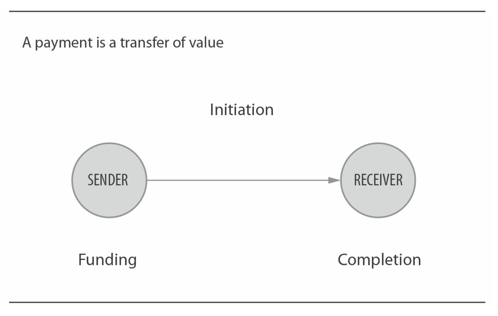

The value transferred is in a specific currency, usually the legal tender of the country's payment system. There are three elements in a payment transfer: initiation of payment, provision of funds by the sender, and delivery of funds to the receiver. In some systems, the receiver initiates the payment, while in others, it is initiated by the sender. The process from initiation to completion can take seconds or 4 to 7 working days, depending on the system.

A payment system, as shown in the diagram below, determines how transfers are made and provides a framework of rules for its users.

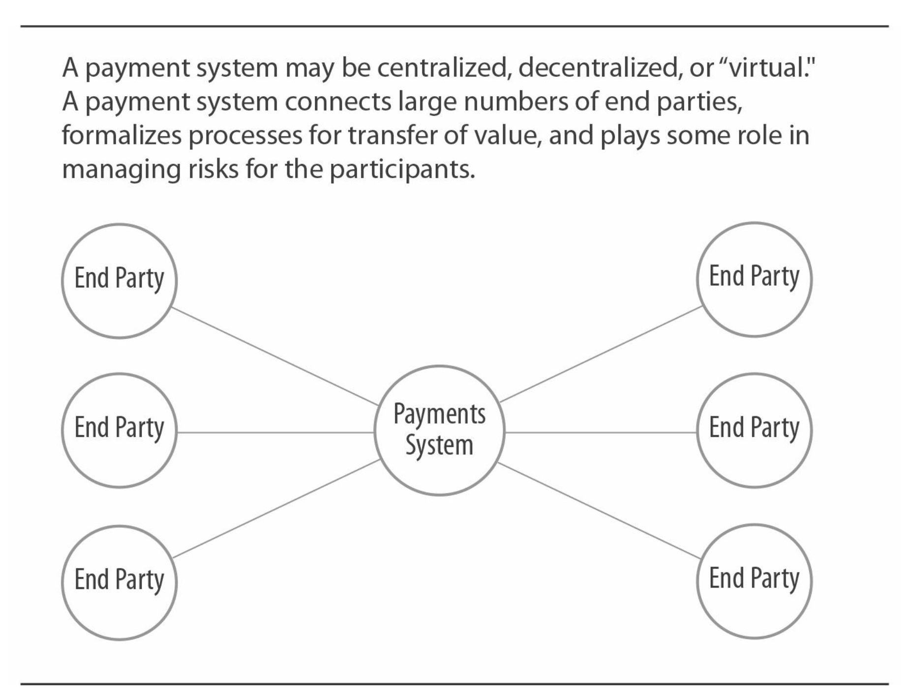

There are many types of payment systems that share the following characteristics:

- Operate at the national level within a single country
- Use the legal currency of that country
- Directly or indirectly subject to government regulation
- Enable participants to interact with each other

## Payment System Models

Payment systems can operate under various models. The two most common are the open model and the closed-loop model. There are also hybrid models that combine features of both.

## Open Systems

Open systems operate in a hub-and-spoke model. Almost all large payment systems use this model. An open system requires intermediaries (usually banks or financial institutions) to join. These intermediaries then establish commercial relationships with end users (such as consumers or merchants).

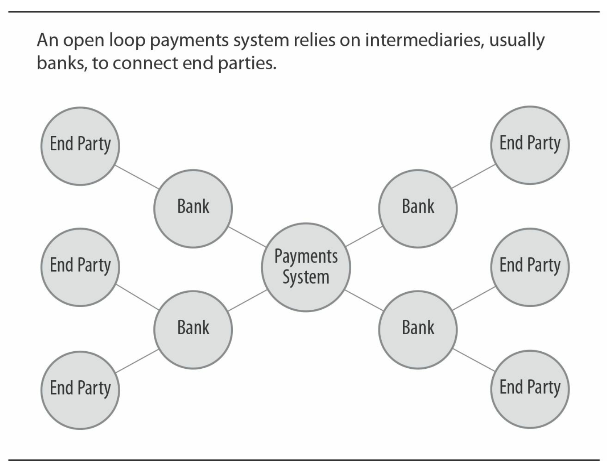

A transaction involves a transfer from one end user to their bank, then to the payment system, then to the bank of the other end user, and finally to the other end user. This structure allows two end users to interact without the need for direct relationships between their banks. Similarly, banks do not need to interact directly.

Most electronic transaction systems today, including paper-based and fully electronic ones (cards, ACH, wire transfers, check imaging), operate under this model. Current technology easily allows for bidirectional electronic transactions. However, we will see that the open model also creates an effective chain of responsibility.

The advantage of the open structure is that it allows payment systems to expand rapidly. All end users can indirectly access other intermediaries in the system.

In an open payment system, the payment network defines the operational rules for participating banks. The banks must ensure that their users comply with the rules. This creates a chain of responsibility:

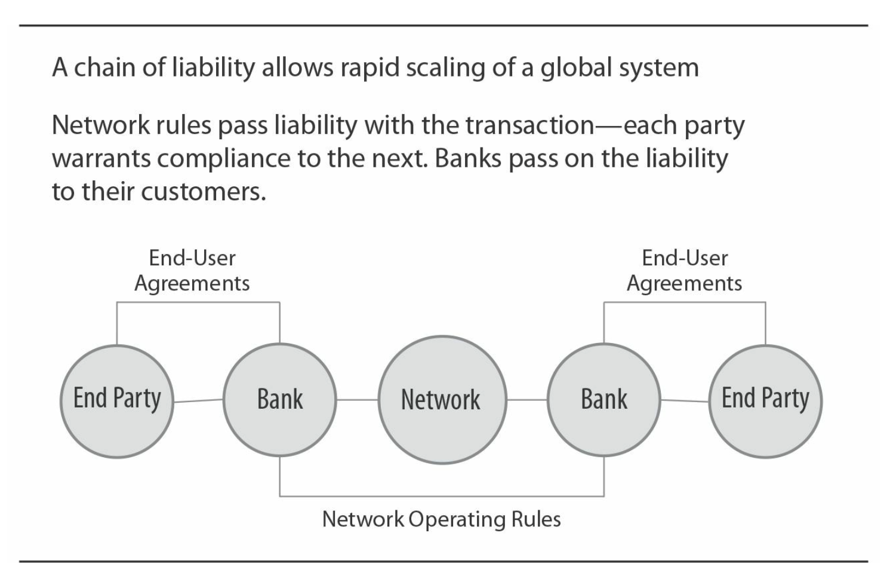

## Open Systems and Chain of Responsibility

In open systems, intermediaries and payment networks ensure the responsibility for their clients' behavior and their own behavior. These responsibilities and their extensions are determined by the operational rules of the payment system and, in some cases, by national laws and regulations.

For example, in an automated clearing house (ACH) system, the originating bank for an ACH receipt must have authorization from the user to use their account. If a user successfully disputes a transaction, the originating bank must compensate the user's bank account.

The originating bank will, of course, attempt to recover the funds from its client, but if unsuccessful, the bank will bear the responsibility alone.

Similarly, in card networks, if a merchant's customer disputes a transaction and requests a chargeback, the acquiring bank is the ultimate responsible party in the payment network for that customer.

## Closed-Loop Systems

Closed-loop payment systems do not involve intermediaries. End users interact directly with the payment system. Early examples of closed-loop systems include American Express and Discover, as well as proprietary card systems (such as a credit card that can only be used at a specific retailer), although some may access open systems to complete transactions.

The advantage of closed-loop systems is simplicity. One entity sets all the rules and interacts directly with end users, making it faster and more flexible than distributed open systems, where changes need to propagate through the system's layers. The drawback of closed-loop systems is that they are harder to scale than open systems; they must personally contract with each end user.

As we will see in Chapter 5 [Core Systems: Cards](ch5.md), some closed-loop card payment systems are evolving into open models.

Payment service providers, such as PayPal or Western Union, are closed-loop systems. However, it is worth noting that these providers are users of open systems themselves, acting as aggregators. They use open systems to fund transactions from senders and transfer funds to receivers.

## Origin: Clearing Houses for Checks

Established in the 1800s, clearing houses for checks were the first large-scale open payment systems in the United States. Before their establishment, each bank had to present checks directly to the issuing bank for payment upon receiving deposits from other banks.

As check usage increased, a complex network was needed to handle the bilateral relationships among banks in cities. Clearing a check from another city was even more complex, often requiring one or more correspondent banks to facilitate payment.

The earliest clearing houses were simple meetings held by representatives of all participating banks in a city each morning. Each bank's clerk would bring bags filled with checks. At the clearing house, checks would be exchanged, and each clerk would record the checks on their bank's accounts (interestingly, in the early days of card systems, paper "sales drafts" were cleared in the same way). Below is an example from 1883.

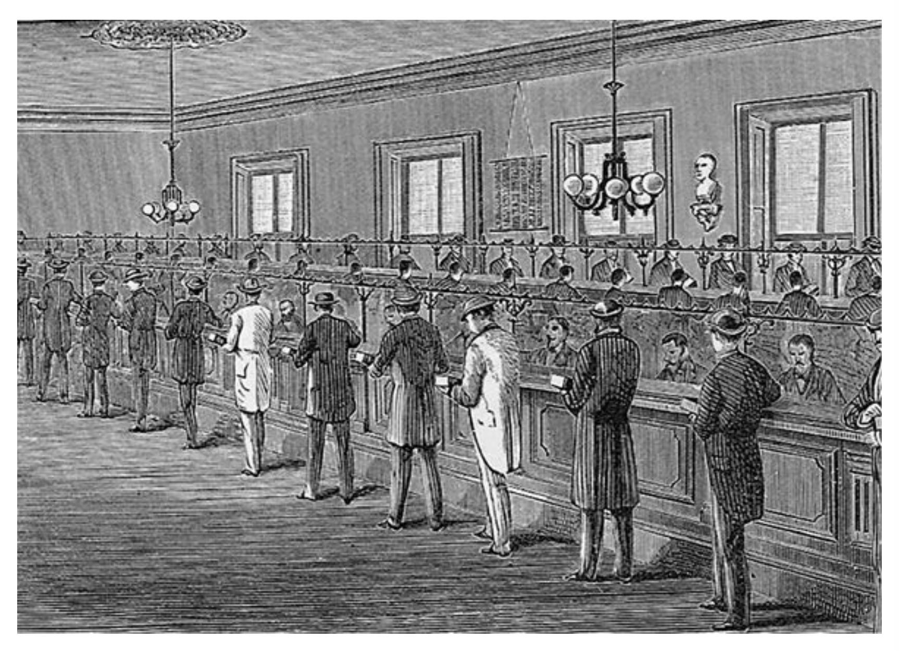

## Other Terms in Open Payment Systems

On-us Transaction refers to a transaction where both parties are from the same bank. Depending on the payment system, this transaction may occur only internally within the bank (not submitted to a clearinghouse or other central node), with the bank settling the transaction internally. In other systems, the transaction may flow through the payment system and back to the bank, similar to other regular transactions. With the increasing consolidation of banks in the United States, the proportion of on-us transactions is growing.

Proxy Bank Relationships
The proxy relationships between banks allow small banks that are not part of the payment system to access the system through participating banks. Many small banks in the United States access the wire transfer system in this way. This model is also widely used in cross-border payments.

## U.S. Payment Systems

There are five core payment systems in the United States:

- Cash
- Checks
- Bank cards (credit cards, debit cards, prepaid cards)
- Automated clearinghouses
- Wire transfers

As we will discuss in Chapter 10 on [Payment Innovation](ch10.md), there are many ways to make payments, including online banking/bill payments, other products such as email and mobile phone payment services. Almost all of these methods rely on one or more core payment systems to actually transfer money. At the time of writing this book, the United States and other countries are establishing a new payment system, "immediate funds transfer," or "Faster Payments System (FPS)."

## Terminology

In this book, we use "end users" to refer to the parties sending and receiving funds. An end user can be a consumer, a merchant, or a business entity (payer, small business, government, nonprofit organization). In any payment transaction, one party is the payer, and the other is the payee. We will see that either the payer or the payee can initiate a payment transaction, depending on the payment system and type of payment.

We use "providers" to refer to entities that provide access to the payment system for end users and other providers. Banks, payment networks, clearinghouses, processors, and service providers are types of providers. Finally, we use "banks" to refer to financial deposit institutions in the United States, including credit unions, thrifts, and savings banks.

We use "payment system" to refer to a group of providers that adhere to common agreements and rules. "Payment network" refers to a specific organization that establishes and maintains network rules. So we might refer to "card payment systems" and "Mastercard payment networks." In other countries, what we call payment networks are sometimes referred to as "schemes."

## Payment System Magnitude

Payment system magnitude can be measured in two ways: transaction volume and transaction value. "Volume" refers to the number of transactions processed, while "value" refers to the total amount of transactions (in card systems, "volume" refers to value).

Some systems are better at self-reporting than others. For example, the wire transfer system and some card systems have quite accurate reporting. However, checks, especially cash, do not have formal mechanisms for precise national-level reporting, so estimates are used. The Federal Reserve Bank of Boston conducts a periodic survey of thousands of consumers called the "Consumer Payment Choice Survey." This survey categorizes card types into credit cards, debit cards, and prepaid cards.

The table below shows Glenbrook's estimates of the total transaction percentage for U.S. payment systems in 2015.

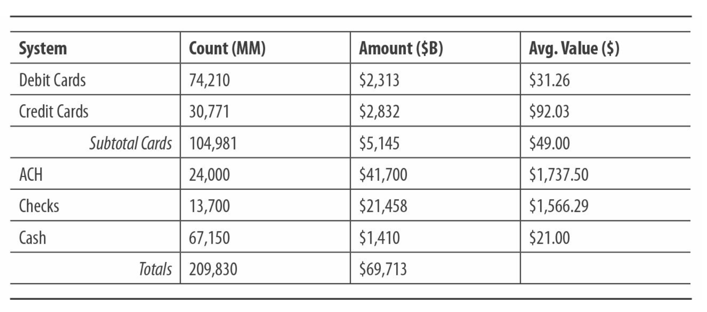

Note that wire transfers are excluded. If wire transfers were included, they would account for less than 1% of total transactions but 93% of total value, as large financial transactions markets typically use wire transfers. The total volume shown is significant, much larger than the U.S. gross domestic product. This is because a single transaction (such as a consumer purchase) can generate multiple payments, as multiple parties along the payment chain participate in payments, settlements, and more.

## Payment System Functions

Payment systems provide three key functions: processing, rules, and brand. Some payment systems rely on a single organization to provide these three functions. Others use virtual or distributed models to achieve them.

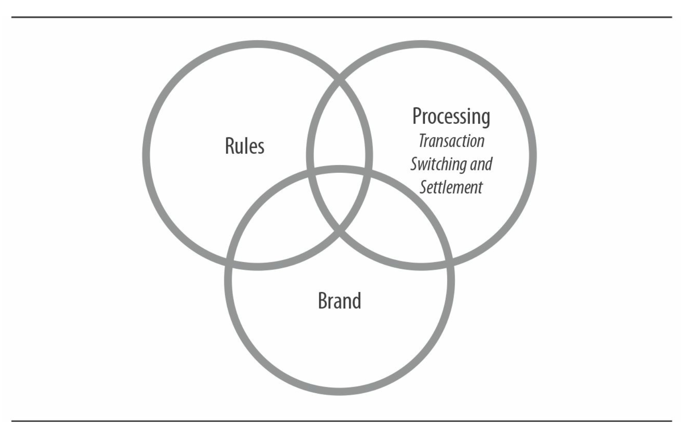

Processing involves exchange—a transaction moves from one party to another. In closed-loop systems, this occurs between two end users. In open-loop systems, transfers occur between intermediaries (representing their end users). Processing also includes settlement—intermediaries transfer value (often aggregated) to cover each transaction they were involved in.

Rules (operating rules or regulations) constrain participants in the system. In open-loop systems, rules constrain intermediaries. While rules cannot directly constrain end users, they require intermediaries to constrain their end users in certain ways. In closed-loop systems, rules directly constrain end users.

Brand dictates how parties in a transaction communicate about payment. In bank card networks, strong branding has always been a key driver of payment system growth.

## Payment Domains

Payments serve various purposes. We divide them into six domains, each with unique characteristics and requirements:

- **Point of Sale (POS)** Payments made at the point of sale. This includes payments at stores and restaurants, as well as in unattended environments like some vending machines and kiosks. POS payments are sometimes referred to as proximity payments.
- **Remote Commerce** Payment scenarios where the buyer and seller are far apart. This includes online and mobile shopping, as well as mail or phone orders. Key segments include e-commerce, online travel and entertainment, digital subscriptions, and digital content.
- **Bill Payments** Payments made based on bill receipts by individuals or businesses. This includes regular payments for utilities, insurance, and services (personal or business).
- **Person-to-Person (P2P) Payments** Payments between individuals. This includes domestic payments between friends and family, as well as cross-border remittances (e.g., immigrant workers sending money to relatives in their home country) and transfers between individual accounts.
- **Business-to-Business (B2B) Payments** Payments between businesses. This includes payments from buyers to suppliers, as well as intra-company payments and significant financial market payments (bank-to-bank transfers, securities purchases, foreign exchange transactions). Governments, nonprofits, and other types of entities are classified as "businesses."
- **Disbursement Payments** Payments to individuals for wages, benefits, discounts, and expense reimbursements.

Payment systems support activities in these payment domains and, in practice, compete with each other at the system level.

A good example is the B2B payment domain, where traditional payment systems like checks are declining for business-to-business transactions. All electronic payment systems are vying for the historically check-based B2B payment scenarios. The ACH system has specialized transaction codes for B2B payments and carries remittance data with the transfer. Bank card systems offer commercial purchasing cards as well as credit and debit card products for small businesses. The wire transfer system is enhancing its network to carry remittance data to meet the needs of this domain.

At the same time, the check system itself enhances competitiveness to maintain transaction volume through system recognition, remote deposit capture, and other advancements.

## Smooth Payment System

The exchange function in an open-loop payment system flows from the first intermediary to the network (which can be the payment system itself in a centralized model or an intermediary node or clearinghouse in a distributed model) to the second intermediary. This message always flows in the same direction. However, the content of the message differs depending on whether the payment is "push" or "pull." While the concepts of "push" and "pull" payments may be confusing, understanding how the payment system works, especially the risks and responsibilities borne by the parties involved in the transaction, is crucial. "Push" or "pull" refers to the behavior of the initiating party. Push and pull payments are illustrated in the following diagram:

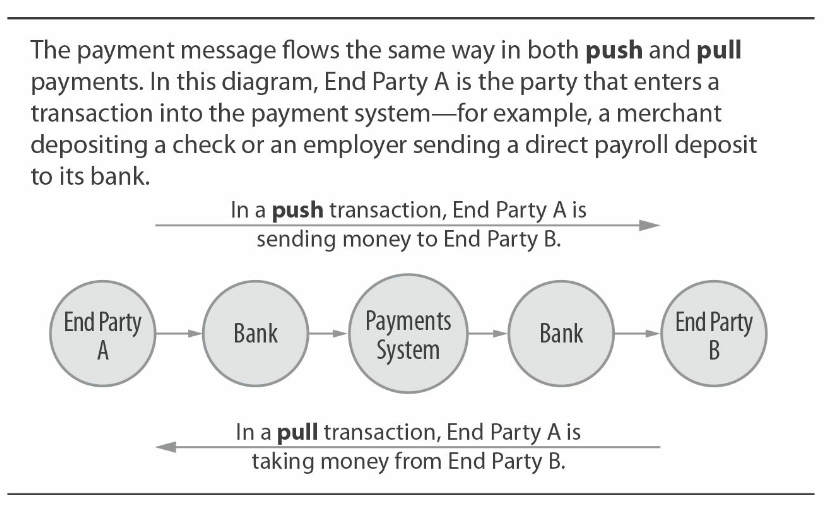

- Whenever "A" transfers money to "B," it is considered a push mode, such as wire transfer or direct deposit via ACH into a payroll account. For example, in a deposit scenario, we see the employer ("A") instructing its bank to transfer funds to the employee through the ACH network. Essentially, the first bank tells the second bank, "I am debiting, you should credit."
- When "A" receives funds from "B," it is considered a pull mode. Checks, debit card transactions, and ACH debits are examples of pull mode. For checks, we see the merchant ("A") depositing a check, instructing its bank to clear the check to receive funds from "B" (the check issuer). Essentially, the first bank tells the second bank, "I am crediting, you should debit."

Considering that push and pull modes involve different parties initiating payments, it is necessary to understand what information each party needs to initiate a payment.

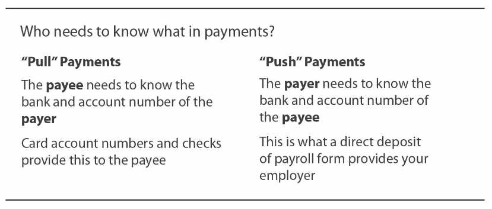

## Payment and Risk

Fundamentally, the risk in "push" mode is much lower than in "pull" mode. In "push" mode, the party with funds is making the transfer, so there is essentially no risk of NSF (insufficient funds) - push mode does not result in "bounced" payments. Additionally, in push mode, the transaction is initiated by the sender's bank, which knows there are sufficient funds in the account. Of course, other types of fraud risks are still possible.

There is a risk of "bounced" payments in push mode. The bank initiating the transaction does not know if the receiving bank can successfully apply the transaction to its customer's credit or debit account. Furthermore, pull mode transactions depend on whether the payer ("B") has authorized the "sender" to make the transaction. (Examples of such authorization include a signed check provided to a merchant or swiping a card and signing or entering a PIN.)

Bank card networks are fundamentally pull mode. Bank card payments are not bounced, but that does not mean they are push mode. They are guaranteed pull mode. Bank card networks achieve this by adding a feature called "authorization" that occurs before the actual "pull." The authorization action asks, "Is there enough funds or available credit balance to cover this transaction?" If so, the "pull" transaction is submitted. Bank card network rules ensure that merchants receiving a "yes" response are protected from risks of insufficient funds and fraud. (Differences in scenarios without physical bank cards, such as in e-commerce, will be discussed in [Chapter 5](ch5.md) and [Chapter 8](ch8.md).)

Data breaches in payment systems typically involve the theft of payer account credentials (e.g., card numbers): stolen credentials can be used to extract funds from accounts. Tokenization is a significant measure in bank card systems to address this risk. Interestingly, under push mode, similar risks may not exist: if the payee's credentials can only be used to push money, the theft of these credentials would not be harmful (Note: unable to pull money).

## Payment System Settlement

Settlement in an open-loop system refers to the process where intermediaries actually receive or send funds. Settlement functions in an open-loop system can be real-time or net settlement:

- In a net settlement system, the payment system calculates the net obligations of participating intermediaries regularly (most commonly daily). At the end of the day, the total net settlement amount is provided to the participating intermediaries, indicating (a) if in a debit position, funds will be provided to the settlement account in that amount, or (b) if in a credit position and with sufficient funds, funds will be withdrawn from their settlement account.
- Checks, bank cards, and ACH are net settlement systems in the United States. For example, settlement of checks and ACH processed through the Federal Reserve Bank is done in batches: the total amount is credited or debited periodically from a batch of processed transactions to the Federal Reserve Bank's bank account.
- The system's rules dictate whether participating banks can be in debt in their settlement accounts and to what extent. This debt is a liability for the participating banks, and failure to fulfill this debt (e.g., if a bank closes during settlement) creates an obligation for the payment system: the system rules will specify how to handle this obligation.
- In a real-time settlement system, each transaction settles in real-time during processing. For example, in the Fedwire system, when the sender's account at the Federal Reserve Bank is debited and the recipient's account at the Federal Reserve Bank is credited, the transaction takes effect immediately. In real-time settlement systems, there is no need for end-of-day settlement.

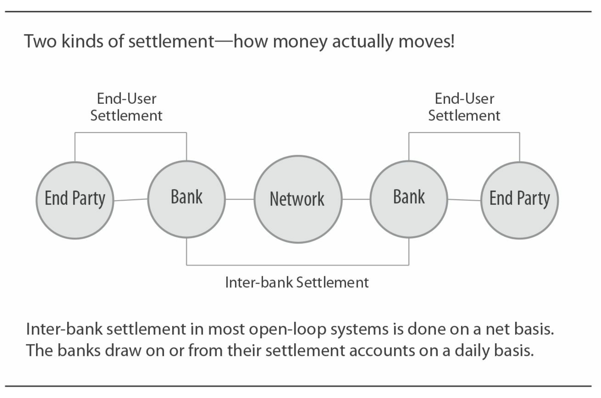

The settlement method for end-users depends on the payment system. The timing and method of crediting or debiting to consumer, merchant, or business accounts depend on the payment system, regulations, or market practices between banks and users.

In a closed-loop system, the only settlement method is for end-users to settle. The operators of the payment system define how such settlements are handled.

## "A New World of Settlement Methods"

In many countries worldwide, significant changes are occurring in the way interbank net settlement is conducted. Settlement cycles are shortening: settlements can occur every few hours or minutes, or when a certain amount of transaction value is reached, rather than at the end of the business day.

Instead of allowing banks to overdraw their settlement accounts, some systems are moving towards requiring participating banks to pre-fund transactions, ensuring they have sufficient funds in their accounts to process transactions.

Finally, some systems are moving towards allowing non-bank entities direct access to core payment systems and the settlement service providers that support these systems. Non-bank institutions are institutions that are licensed and legally allowed by national law to conduct certain types of payment transactions within a country/region. The United States has not adopted these changes in its core systems.

## Virtual Systems

The United States has two core payment systems, cash and checks, which operate virtually. By this, we mean that there is no formal payment system that allows end-users or bank intermediaries to "join."

Of course, we all know how cash operates. Transactions are directly "exchanged" and "settled" between two users. From this perspective, it is a push system. Other aspects of cash payments are discussed in [Chapter 6](ch6.md).

The U.S. check system automatically includes all financial depository institutions, which do not need to "join." However, banks typically join one or more clearinghouses to exchange and clear the checks they receive in user deposit transactions. Clearinghouse rules are more restrictive compared to rules for card networks or ACH networks. This is partly because the U.S. has broader legal regulations for paper checks. Other aspects of checks are discussed in [Chapter 3](ch3.md).

These virtual systems do not have major brands, nor is there a central network promoting their use.

## Ownership and Regulation of Payment Systems

### Ownership

Most payment systems in the United States were initially owned by banks. As shown in the table below, over the past decade, many of these payment systems have transitioned to different ownership models. Some non-bank-owned payment systems are publicly traded companies. Others are privately held.

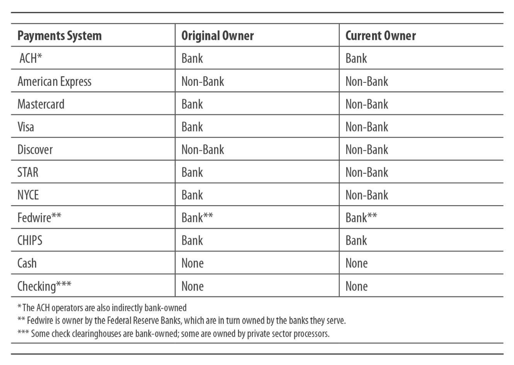

Payment systems owned by large banks often establish rules that benefit the overall banking industry. This can promote "fair competition" - all participating banks can equally use the products and services. Systems with high staff and advertising budgets (especially card networks) create entirely new products, which are then distributed to their customers by member banks. Smaller budget systems (such as ACH) have a much smaller role in product definition and management, providing only operational rules and platforms for banks to create products.

### Regulation

A combination of government regulations and private rules govern the U.S. payment systems. Government rules are composed of laws and regulations issued by legal authorities and government agencies for enforcing these laws. In the U.S., the primary issuer of payment regulations is the Federal Reserve Board. Private rules can be network rules or simple service contracts: the Federal Reserve Bank's operating circulars (governing the Federal Reserve Bank payment services provided to banks) are an example. Private rules can be considered "agreement-based."

### Private System Rules

Most payment systems require intermediaries (open-loop systems) or end-users (closed-loop systems) to formally join the system. Parties joining the system are bound by the system rules. In open-loop systems, the contracts between intermediaries and end-users typically include terms specified by the system rules, subjecting end-users to certain system rules. These operational rules are crucial, especially for open-loop networks, as they define the necessary conditions for successful interaction among thousands of end-users.

Operational rules cover a wide range of topics, including:

- **Technical Standards** data formats, token (e.g., card) specifications, transmission and reception functions, data security standards, etc.
- **Processing Standards** time limits for submitting and returning transactions, requirements for posting to end-user accounts, etc.
- **Membership Requirements** types of institutions that can join, capital requirements, etc.
- **Payment Acceptance Requirements** restrictions on accepted payment transactions.
- **Exception Handling and Dispute Resolution** rights and requirements of intermediaries and end-users, typically in cases of disputes or rejected transactions.
- **Fees** processing fees and other charges paid to the payment system; fees between intermediaries (if any).
- **Branding and Trademarks** standards for using payment system brands.

  The introduction of new products at the payment system level (e.g., contactless cards) or new transaction types typically requires a new set of operational rules specific to that product or transaction type. Compliance with operational rule requirements can have significant financial implications for users and providers of payment systems. Investors may need to meet technical standards or provide certain forms of services, such as dispute resolution mechanisms; changes in liability definitions or risk allocation can also have significant impacts.

  Some open-loop payment systems, such as Visa, Mastercard, and NACHA (used for ACH), publicly provide most operational rules on their websites. Other payment systems like CHIPS (used for wire transfers) and most PIN debit card networks do not provide their operational rules to non-members.

Changing operational rules of payment systems can be challenging and may take several years to implement. Most payment systems have multiple layers of committees through which participants can consider proposed rule changes. There is typically a one-year or longer delay between rule approval and implementation of new rules.

As mentioned earlier, the U.S. check payment system is a "virtual" system without central authorization. However, banks do join one or more check clearinghouses to process checks. The behavior of these clearinghouses is similar to payment systems, as their operational rules bind members. The scope of such rules is often narrower compared to rules in card, ACH, and wire transfer systems. Check clearinghouse rules may specify timeframes for presentment or return of items, imaging standards, etc.

### U.S. Laws and Federal Reserve Regulations

U.S. laws specifically regulate certain payment systems, while others are more general. The Federal Reserve imposes laws and explicit requirements to regulate banks under its supervision. Key laws and regulations include:

- U.C.C. Article 3 - Negotiable Instruments.
- U.C.C. Article 4 - Bank Deposits and Collections.
- U.C.C. Article 4A - Funds Transfers.
- Check 21 Act.
- 2009 Credit Card Accountability Responsibility and Disclosure Act.
- 2010 Dodd-Frank Wall Street Reform and Consumer Protection Act, which includes the Durbin Amendment related to U.S. debit card issuing and acquiring banks.
- Federal Reserve Regulation E (implementing provisions of the Electronic Fund Transfer Act) applies to consumer electronic transactions, including debit cards, ATM withdrawals, and ACH transactions (but not credit cards). Among other provisions, this regulation establishes critical consumer rights for the refusal and revocation of unauthorized transactions.
- Federal Reserve Regulation CC - Availability of Funds and Collection of Checks.
- Federal Reserve Regulation Z - Lending standards that provide a uniform method for calculating credit costs, disclosing credit terms, and resolving errors in certain types of credit accounts.
- Federal Reserve Regulation J - Governs the procedures, responsibilities, and liabilities of the Federal Reserve Banks; senders and payers of checks and other items; and senders and receivers of Fedwire funds transfers.
- Federal Reserve Regulation II - Limits debit card interchange fees for regulated (large) banks and specifies minimum routing options for debit card networks.

### Image Processing Clearing and Regulatory Framework

Today, with the rapid shift towards image clearing, banks, processors, and clearinghouses need to deal with a complex regulatory framework. For example, some regulations that apply to paper check clearing are no longer applicable to image clearing. This is a transitional period for the industry as it evaluates the right regulatory model for the world of full image clearing.

Many other important laws, regulations, and directives fall under the general category of banking regulations. These include regulations on money laundering, privacy, credit reporting, and other payment-related issues. Regulatory requirements around "Know Your Customer" (KYC) are particularly important for both banks and non-bank entities in the payment industry. Various identity verification procedures are required before opening customer accounts as per the Bank Secrecy Act and the USA PATRIOT Act.

### State Banking Authorities

State banking authorities' state laws and regulations primarily apply to non-bank providers of payment services, often referred to as "money transmitter regulations." They regulate the issuance of sale and payment instruments, as well as transfers or receipts. Almost every state now requires money transmitters to obtain a state license, post a bond, and maintain a certain level of net worth or allowable investments. It is worth noting that the regulation of money transmitters varies across states, posing additional challenges for payment companies with national ambitions. State banking authorities also regulate state-chartered banks.

### Future of Payment Monitoring

Reflecting on the future of payment regulation in the United States can be intriguing. Some may argue that compared to other countries, the U.S. allows more self-regulation of major payment systems. This may be because U.S. banks are subject to strict oversight by multiple agencies. Therefore, historically, payment systems owned by banks have actually operated under the "umbrella" of regulation. Today, many payment systems are no longer bank-owned. Does this mean that federal regulatory agencies and other regulators may start playing a more active role in the industry?

## Economic Model of Payment Systems

Payment system providers, including banks, networks, and processors, earn money by providing access to payment systems for end-users. End-users include consumers, merchants, and businesses (consumers, other businesses, government, and non-profit organizations). Processors and networks also earn revenue by providing payment services to intermediaries (such as banks). Many banks provide payment services to other banks as part of correspondent banking relationships. Merchants can also provide payment services, for example, when they offer proprietary or gift cards to consumers.

In this book, we will discuss the economics of each core payment system in turn. However, some general views can be drawn about the economics of payment systems:

- In open and closed-loop payment systems, providers have a direct business relationship with end-users. Providers price their services like any other business. Providers earn revenue from payments through both direct and indirect sources. This applies whether the end-user is a consumer or a business. Direct revenue comes from explicit fees charged to end-users; these fees may include transaction fees, related loan interest, monthly maintenance fees, and exception fees (overdraft fees, returned check fees, late payment fees). Indirect revenue comes from net interest income on deposit balances, float, and fees.
- In some open-loop payment systems, rule-making bodies can define fees for the system: a fee paid by one intermediary to another as compensation for processing transactions on behalf of the other.
- Providers typically price payment products as part of a bundled service package, for example, bundling ATM access, check writing, and debit card access into a checking account. Similarly, providers may offer card acquiring services to small merchants at a bundled price but use unbundled pricing for the same service to large merchants.
- The costs associated with providing payment services are a mix of fixed and variable costs. Typically, payment system providers have high fixed costs per transaction, while incremental costs are low. For example, a bank incurs costs such as staff, maintaining branches, hiring services to replenish ATMs, and expenses to work with check processing centers. Although unit costs can be calculated (by adding expenses and dividing by the number of transactions), they are not always accurate indicators of incremental costs. Over the past decade, as check volumes started to decline sharply, leading to a "death spiral" where the same fixed cost base is spread over fewer and fewer checks, many banks realized this was an issue. However, with the advent of image recognition processing, banks have been able to halt this processing flow and reduce check processing costs.
- The payment industry differs significantly from other industries in one crucial aspect, the value of funds transferred through the system. Revenue models based on the total value of payment transactions ("volume") are more likely to result in profitable businesses compared to those based solely on fixed fees per transaction ("click fees"). This kind of "ad valorem" (percentage-based) revenue can be direct (fees calculated as a percentage of transaction amounts or applicable to loan balances) or indirect (value of deposits held at banks or float).
- The economics of exception handling are crucial in payment systems. Exceptions can occur simply due to errors during processing (e.g., a check getting shredded in a sorter). In a pull model, it could be a chargeback. It could also be a customer inquiry or dispute. Typically, the costs of handling these exceptions are much higher than processing standard transactions. The efficiency of a provider in managing exception handling can significantly impact the overall economic viability of their product. In recent years, providers have become increasingly aggressive in pricing exceptional transactions to end-users. In some cases, the revenue generated from processing exceptional transactions far exceeds the transaction costs, greatly enhancing the profitability of the product. For example, returned check fees, card bank overdraft fees, and overdraft fees are such cases.

### Fees

**What Are Fees** Fees are a component of the payment system economics used in some open-loop systems, especially in bank card networks. Fees are payments made from one party in a payment transaction to another. Payment systems set the prices for fees but do not themselves collect the fees. Fees provide an incentive for one party in a transaction to reimburse the other for some incurred costs.

**Payment Systems and Fees: Some Have, Some Don't** In the United States, wire transfers, ACH, and check clearing systems have traditionally operated without fees, meaning there is no defined transfer fee between the "sending" and "receiving" banks. Bank card network transactions do incur fees. This significant economic difference sometimes fosters various alternative payment solutions. The ACH system recently approved a new processing model - "Same Day ACH," with a "fee" component.

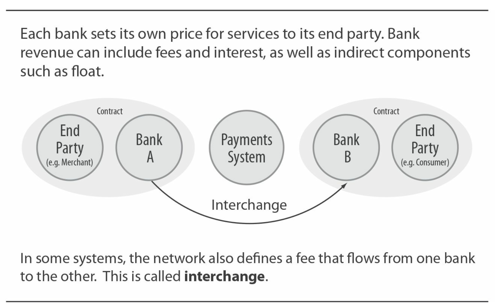

### Risks, Float

### Float Funds

When a provider (e.g., credit card issuer or payment service provider) actively assumes risks that another party would bear, they can be well compensated. If a provider is aware of risks but cannot manage them effectively, or worse, does not understand the risks, the provider's business will not be sustainable.

### What is Float? (Part One)

Float is the value obtained from holding funds for a period of time. This is income for the party that holds funds before spending them and a cost for the party that needs to pay before receiving income.

## Risk Management

All payment transactions involve risks. Some risks, especially fraud risks, are highly publicized. However, there are many types of risks, and all parties involved in payment transactions bear some risk. The payment industry focuses on three main forms of risk:

- **Credit Risk** Credit card issuers bear significant credit risk: cardholders may be unable to repay their loan balances. But there are other types of credit risk as well. For example, whenever a bank allows an overdraft instead of rejecting a pull-mode payment (debit card, check, or ACH receipt), it incurs risk. Less obvious is the credit risk borne by the bank on the "sending" side in a pull-mode transaction (acquiring bank or check deposit bank) because it assumes financial responsibility for its customer's actions.
- **Fraud Risk** As shown in the consumer and merchant examples in the table below, there are many types of payment fraud risks, some specific to certain payment systems and others more common. Some payment systems (such as bank card systems) have high-level system-defined fraud management. Other fraud risk management, such as for checks and ACH, is more left to intermediaries and end-users.

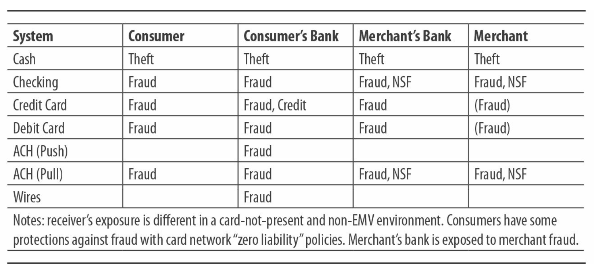

### Evolution of Fraudsters

Fraudsters have endless inventiveness, quickly discovering new technologies or practices to defraud merchants, banks, or consumers. The hallmark of payment system fraud management is the rise in fraud volume, followed by the introduction of new fraud countermeasures, prompting fraudsters to shift to other payment systems or environments.

- **Liquidity Risk** The risk that one party cannot fulfill its financial obligations to another. In open systems, end-users are financially responsible to their banks, which are responsible to the network. The network, in turn, is responsible to the banks. The network's risk is known as settlement risk. This feature is crucial in open systems: it means that a bank receiving funds from another bank in the system does not need to worry about the liquidity of the remitting bank. However, the network does need to worry. If a network member fails (goes bankrupt) while in a net debit position for the day, the network (in most cases) must pay the obligations of that member to other members. This is one reason why most open networks restrict membership to regulated financial institutions that meet certain capital standards and are subject to ongoing supervision.

  In addition to these three main forms of risk, there are many other minor forms of risk:

  - **Operational Risk** Arises when a party fails to complete expected operations or performs erroneous operations. Many situations fall into this category: missing deadlines, incorrect file formats, machines not starting or not functioning properly (e.g., check sorters jamming), etc. Because of operational errors, severe financial consequences can occur: one party holds funds that should have been transferred to another. Every payment system has rules and practices for intermediaries in the system to help each other recover from errors and avoid financial losses, but not all losses can be fully recovered. The roles of service providers and other third parties (meaning non-bank intermediaries in the payment chain) are crucial for understanding operational risk. Typically, third parties, according to payment system rules, "act on behalf of" banks that have formal legal responsibility. If a third party makes a mistake in some way, the bank still bears the responsibility. Therefore, many payment systems recognize the role of third parties and create rules to constrain their direct members (banks) to regulate third parties participating in the payment system.
  - **Data Security Risk** Participants such as banks, service providers, networks, or others holding end-user data may face actual or potential fraudulent use of data. Bank networks have created and implemented PCI-DSS (Payment Card Industry Data Security Standard) to manage this issue. Recently, the banking card industry has begun using tokenization to further protect payment card credentials.
  - **Reputation Risk** The risk of end-users losing confidence in the correctness of the payment system. Recently in the United States, incidents of merchants and service providers losing payment card data have damaged the reputations of these companies, leading to some high-profile cases, including resignations of senior executives.
  - **Regulatory Risk** Intermediaries, networks, and service providers may face uncertain risks, especially when payment practices change due to unclear interpretations of private rules or government regulations. Additionally, innovation often outpaces regulatory updates, but regulations usually catch up to address potential risks in consumer or system areas.

Lastly, there is exchange rate risk, or currency risk, in ensuring the position of a transaction before setting or knowing the actual exchange rate.

### Balancing the Fraud Equation

The cost of fraud must constantly be balanced with the cost of preventing or reversing fraud. In many payment industries, some degree of fraud is accepted as a "cost of doing business" (more or less). For example, card issuers may be willing to process low-value transactions without a signature, or a bank may decide to honor an ATM withdrawal fraudulently once as a "trust-building decision with the customer." However, as the quantity increases, the industry starts to operate and develops and applies new fraud control mechanisms.

## Comparative Payment Systems

When evaluating or comparing payment systems, many factors need to be considered. As mentioned earlier, payment systems compete with each other, especially when payment behaviors undergo long-term changes, such as transitioning from cash to non-cash instruments. Payment system providers consider this when deciding whether to support new payment forms. Users consider whether to use new payment forms when evaluating them.

- Open or closed loop?
- "Push" or "pull"?
- Net settlement or real-time settlement?
- Ownership - private or public; owned by banks or not?
- Regulations - private rules and/or laws/regulations?
- Batch or real-time processing?
- Economic model - flat rate? Are there fees between participants?
- Which brand to use (and how)?
- Does the payment system define "products"?
- Are payment system rules established for:
  - Guarantees for payments?
  - Timing of funding - before, during, or after the transaction?
  - Handling exceptions?
  - Fraud management procedures?
  - Dispute resolution - handled as part of the payment system?
  - How to handle "on-us" transactions?

Over the years, we have had the opportunity to collaborate with many payment system entities and have developed a set of key economic factors that we believe can drive the economic development of payment systems:

- Risk-reward - How do you assess and price risk?
- Percentage fees are better than fixed fees
- Currency conversion can be profitable
- Processing is best done at scale
- Merchants pay to receive payments
- Bank consumers do not pay to make payments; consumers without bank accounts often do
- Exception handling is costly
- Simplification has economic value

## Thick or Thin?

Some payment networks are rich in resources (i.e., have a lot of money) and can invest at the network level in product definition, branding, risk management, and exception handling requirements. Visa, Mastercard, American Express, and PayPal are examples of what we call "thick model" networks. Other networks are resource-poor, managing only the minimal interaction issues and leaving functions such as product definition and branding to intermediaries. Check clearinghouses, ACH, and PIN debit networks are examples of this "thin model."

Many of these networks were initially bank-owned. Why would bank owners support a "thick model" in one case and a "thin model" in another? We believe this can be traced back to the reasons for the network's existence. In the "thick model," the network brings significant profits to its member banks. In the "thin model," the network's existence is to reduce costs (e.g., in check processing), thus serving as an efficient tool to operate.

In the United States, the card industry began with high-profit credit card business, which is why some may argue for supporting the "thick model." Card networks have successfully extended this model to the lower-profit debit card arena.

## Cross-Border Payments

Cross-border payments involve one country's end users making payments to end users in another country. Let's see how cross-border payments are facilitated using open payment systems.

As a background, remember that by definition, payment systems operate within a country/region: only banks chartered or licensed to operate in a country/region can join the payment system in that country/region. Therefore, transferring funds between countries typically requires two separate transactions, one in the sending country and another in the receiving country. This holds true even for transactions priced in the same currency across two systems.

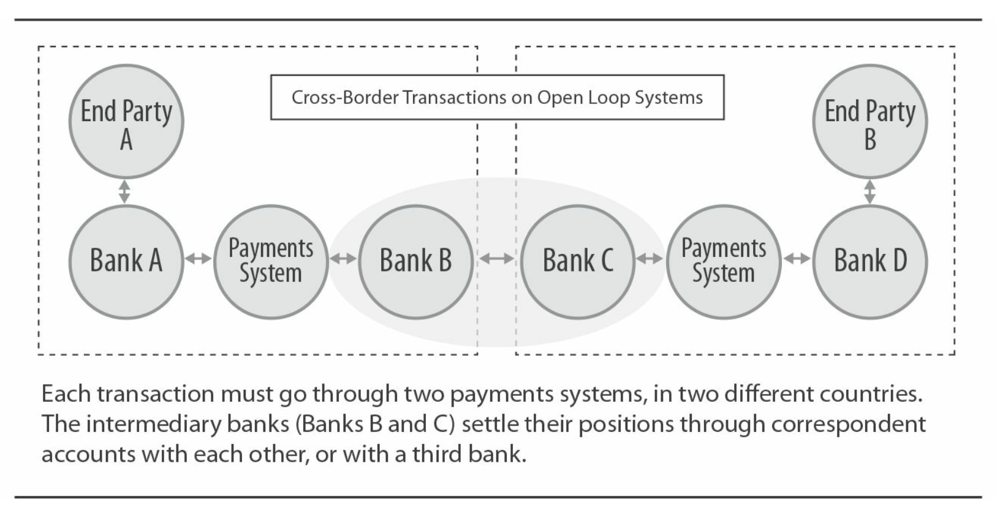

### Global Payments

Global card networks tie together a series of country-specific payment systems to create the effect of a global payment system. For end users and even intermediaries, it appears as a global system. However, in reality, global card networks keep the complexity of cross-border systems within a certain range. Similarly, emerging ACH to ACH services (such as the Federal Reserve's global ACH service) enable banks to clear items without the dual complexity of systems.

In Europe, the SEPA (Single Euro Payments Area) payment system attempts to address issues that became very apparent with the introduction of the Euro: for example, payments from France to Germany, even priced in one currency, had to be processed in two payment systems: first in France, then in Germany. SEPA created new debtor and creditor payment systems that banks in SEPA countries can directly belong to.

Payment service providers and closed-loop systems enable end users from different countries/regions to transact with each other. The operators of closed-loop payment systems then establish relationships with payment systems or banks in the involved countries/regions to receive, process, and settle payments as needed. How systems operate varies; PayPal and Western Union are interesting examples.

Of course, these transactions still need to be settled between banks. This is done through a complex network of correspondent bank accounts owned by banks interconnecting with each other. These accounts may be located in the sending country, receiving country, or a third country. The global financial messaging service SWIFT plays a crucial role in carrying instructions for these payments from one bank to another.

Conducting an economic transaction in two separate payment systems (or in some cases even more) introduces complexity for end users and often leads to confusion. Systems may have different schedules, rules, and data formats. End users in one country (or even the banks in that country) often struggle to understand how transactions are handled in the receiving country. High fees are not uncommon. Foreign exchange adds additional complexity and often brings substantial revenue to one or more parties involved in the transaction. Large banks have correspondent banking departments to manage such payments for their smaller bank clients.

### Payment Systems Vary by Country, Not Region!

People often hear generalizations about regional payment systems or behaviors: "Everyone in Europe uses debit cards" or "Prepaid cards are common in Asian public transportation systems." The reality is that each country has its own story when it comes to payment systems. So, do not believe these generalizations - check the systems and patterns in each country/region.

## Payment Systems in Other Countries

If you want to learn about the payment systems in another country/region, you can start by visiting the website of that country's central bank. The central bank directly or indirectly regulates and supervises the payment systems in its own country.

Although the types of payment systems available in each country/region are very similar, the per capita usage of these systems varies greatly. For example, there is a significant difference in the usage of checks between countries like France (where checks have traditionally been popular) and Germany (where checks are rarely used).

This book focuses on the payment systems in the United States, but in general, the principles discussed in this text also apply to other countries/regions.

## Changing Payment Networks

Large-scale, open payment systems have high efficiency and scalability, which many other industries envy and seek to achieve similar levels of seamless interoperability. (For example, consider the exchange of electronic medical records!)

The downside of this structure is the inherent inertia of the system. With reliance on the same standards, rules, and responsibility frameworks, multiple remote participants can easily interact, but this also means that changing these standards is very challenging. Improvements or enhancements by one participant can have significant impacts operationally, technically, or economically, which may not immediately manifest when proposing changes. Many proposed changes require simultaneous adjustments to technical standards, operational procedures, risk management processes, pricing, and even the physical formats of payment devices (checks, bank cards, terminals, etc.). Changing open payment systems may take several years, starting at the committee level (e.g., collaborating with representatives from risk management groups of participating banks) and then moving up to senior management within the network. Even with approval, changes to payment systems may not take effect for a year or longer (allowing participants time to prepare and implement the changes).

## Summary: U.S. Payment Systems

Various payment systems in the United States facilitate the transfer of currency and share many similar attributes. However, there are significant differences between them. Understanding these differences is key to understanding the different purposes and efficiencies of the systems. The table below provides a comparative overview of core systems.

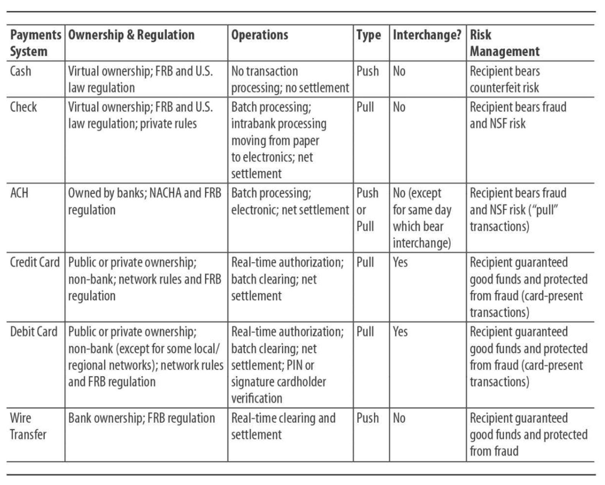

## Sources of Payment System Information

There are many sources of information about the payment systems in the United States. The resources listed below are some good starting points. More information about each core payment system is provided at the end of each chapter.

- PaymentsNews.com
- Clearinghouse
- Federal Reserve Bank Payment Systems
- American Banker
- Nielsen Report
- Bank for International Settlements
- National Central Banks
