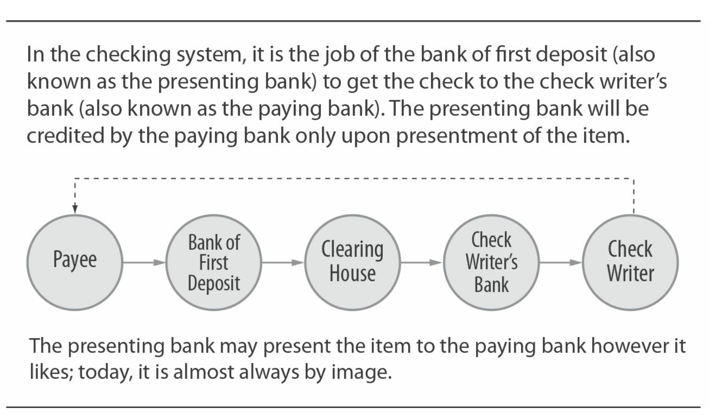
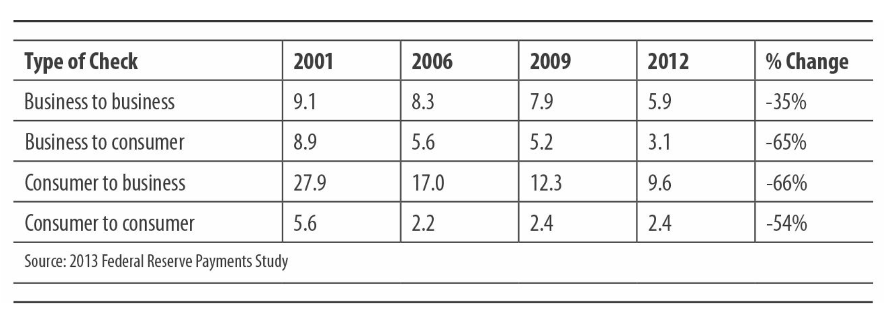
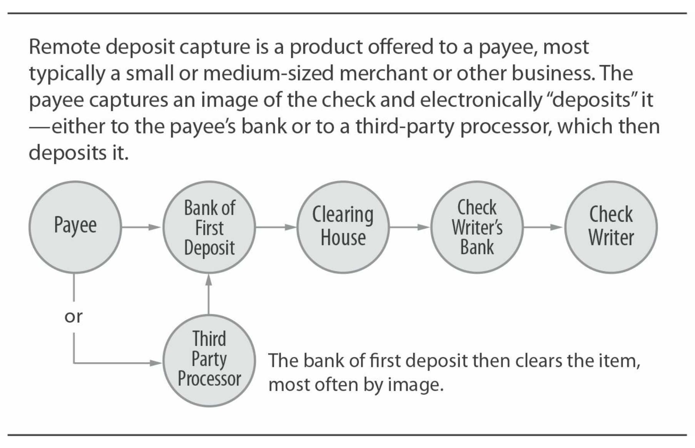

# Core System: Checks

* Type: Pull Mode
* Ownership: No single owner, check clearinghouse owned by banks or private processors
* Regulation: U.S. law, payment network rules, Federal Reserve banking regulations
* Payment Network Economy: Settlement by face value
* Processing Flow: Banks use image recognition or paper clearing; batch processing
* Risk Management: Intermediaries and end-users management

&nbsp;
## Historical Background

The check system in the United States is one of our oldest systems and one of the most widely used open payment systems. The origins of the check system we know today can be traced back to the Middle Ages, perhaps even earlier. Many economies developed some version of a document that allowed funds to be transferred from one bank to another. The word itself comes from the Arabic word şakk. There are many related payment order documents, including drafts, bills, promissory notes, and letters of credit, as well as specialized forms of checks such as cashier's checks, certified checks, and bank checks.

Checks are considered negotiable instruments. They instruct a bank to pay funds from the depositor's checking account and provide those funds to the person or entity specified on the check. As negotiable instruments, checks can be transferred from one person to another. In the United States, checks are a service provided by banks and other regulated financial institutions for operating demand deposit accounts (DDAs), formally known as checking accounts.

Today, the U.S. check system is a highly automated means of transferring funds from one end-user to another. While check transactions start on paper, almost all check processing today is electronic. This electronic processing, combined with very high transaction volumes, results in relatively low unit costs.

Customers presenting or depositing checks at their banks pose a problem for the banks. A check is a claim on an account (usually at another bank). How does a consumer's bank collect funds from another bank? Historically, this process was known as bilateral settlement. The deposit bank would send a messenger to the other bank; the messenger would present the check and collect funds (which could be gold, cash, or notes) in return.

From the early days of the United States, the development of the check system can be divided into three significant stages, all marked by advancements in clearing and settlement methods.

&nbsp;

## Phase One: Development of Clearinghouses

In the 18th and 19th centuries in the United States, the number of banks and the number of checks being issued were increasing, making the bilateral clearing and settlement process increasingly cumbersome. Mail carriers carried bags of checks to be delivered to other banks; cash or other items received from the exchange could also be stolen.

In 1853, the first check clearinghouse was established in New York City. Banks joined the check clearinghouse and each bank would present checks deposited by other member banks on each banking day. The check clearinghouse facilitated orderly check exchange between banks, and importantly, calculated the daily net settlement amount for each bank. Banks would then provide or draw funds from their settlement accounts. Soon, similar check clearinghouses were established in other major cities, as well as intercity, regional, and interstate check clearinghouses.

The establishment of the Federal Reserve System in the early 20th century played a crucial role, requiring its member banks across the nation to accept deposit checks at face value. This meant that the deposit bank would credit its customer's account "1 dollar for 1 dollar" rather than at a lower percentage. The Fed's requirement, along with the development of check clearinghouses nationwide, turned checks into a truly national payment system.

&nbsp;

## Phase Two: Automation — MICR and Sorters

In the late 1950s and early 1960s, the introduction and widespread use of Magnetic Ink Character Recognition (MICR) characters enabled high-speed check processing. MICR characters (used to identify the bank and account where the check is drawn) appeared at the bottom of checks. The check amount was added after the check was generated, typically by the bank of first deposit during a process called encoding. Both banks as well as clearing centers and processors used check sorters to read the MICR line and sort individual checks into bins. As each check passed through the sorter, they would often capture images of both sides of the check.

Further developments facilitated nationwide automated check processing. The use of a uniform bank numbering scheme by depository financial institutions (assigned by the American Bankers Association as routing transit numbers) was a significant factor. Laws prohibiting interstate banking gradually dissolved, leading many large national and regional banks to focus on a broader definition of "on-us": many banks found themselves members of multiple check exchange facilities for the first time. The advent of large-scale air transportation services reduced the hassle of processing chains for correspondent banks. Processors developed "on-we" check clearing capabilities for smaller banks, somewhat mimicking the multi-state check processing capabilities of national banks.

### What If?

If the check system had evolved in a different direction, adopting a discount (rather than face value) clearing and settlement model, the system would look much like our exchange-based card payment systems. A merchant receiving a $100 check could deposit the check in their bank, crediting their account with $98. The bank would then present the check to the consumer's bank and receive a credit of $98. The consumer's bank would debit $100 from their customer's account, keeping the remaining $2 as transaction profit.

Some industry observers suggested that the Fed impose a similar "face value" model on debit card transactions, akin to checks, but with the added benefit of "good funds" and fraud protection provided by cards. The Fed was not persuaded to do so, leading to increased lobbying efforts to ensure legislation followed these guidelines. The passage of the Durbin Amendment as part of the Dodd-Frank Act in 2008 by Congress may have been influenced by these efforts.

&nbsp;

## Phase Three: Imaging

While MICR and check sorting equipment could automate check exchange, banks still had to manage and store paper checks. This posed a particular burden for banks, having to retain physical checks and frequently return them along with statements to the drawee bank. Others in the chain, including depositary banks, intermediary banks, and processors, might need to view paper checks to resolve disputes or inquiries, leading to cumbersome and costly work. As imaging technology matured in the late 1980s and late 1990s, banks found an opportunity to reduce internal costs for storing and retrieving checks for inquiries. Banks began adding cameras to their check sorting machines to capture images of each document passing through the machine.

The bank has spent over a decade investing in and learning to use image technology, primarily for archival purposes. Using images for clearing (exchanging images instead of paper) is a logical extension. During this time, bankers worked together in different groups to explore "electronic checks" and "check truncation." Some large banks did exchange images. Others used private multilateral agreements to exchange MICR line data files for presentment and then conducted physical checks. In either case, the basic law still requires the issuance of a check to the bank of the check issuer using the original paper check. This greatly hinders the work of clearing through images, as any bank along the line may need to use the original paper check in case of disputes, queries, or errors.

The Check Clearing for the 21st Century Act, which took effect in October 2004, addressed this issue. Check 21 was proposed and sponsored by the Federal Reserve, which wanted the industry to move towards electronic settlement but did not want to mandate it.

### Grounded Aircraft

The events of September 11, 2001, are often seen as the reason the Federal Reserve took action to support the Check 21 Act. In the days following the attacks, when planes were grounded and checks were not moving, the Federal Reserve (acting as the agent for check processing, with checks presented to the Fed being deposited in the presenting bank's account at the Fed) reached alert levels as it could not present checks to paying banks. In fact, the Fed had been actively pushing for laws like Check 21 for some time: 9/11 propelled the advancement of this law.

The Check 21 Act did not mandate clearing through images but simply declared that printed copies of the original checks ("substitute checks" or "image replacement documents" - IRD) are legally equivalent to the original paper checks.

Banks may still refuse to accept images but must accept printed copies of images. In practice, this means that a deposit bank located far from the check issuer's bank can send images (usually through a clearinghouse) to a printer near the check issuer's bank; the paper printout can stand in for the deposit bank.

In today's America, the check payment system is almost entirely electronic, as imaging has proven to be a significant advancement in speeding up check collection, reducing risks, and lowering operational costs.

&nbsp;

## Roles and Value Chain

The most basic aspects of the check payment system involve three parties: the check writer, the check recipient, and the bank where the check is deposited. If (in the most typical scenario) the check writer and the payee use different banks, there are four parties involved. The check value chain is illustrated in the following diagram:

### Checks: Our Latest Electronic Payment System

The impact of Check 21 is remarkable. Most banks began serious implementation of check image clearing from 2007. By early 2010, the Federal Reserve announced that 99% of check clearings processed through the Fed were done electronically.

The check issuer's bank provides its customers (whether consumers, businesses, nonprofits, or government entities) with current deposit accounts featuring checks. The check writer's bank provides blank checks to customers or checks with detailed information (routing numbers and account numbers).

The check writer writes a check, specifying the payee, date, and dollar amount. Writing can be a manual operation like that of a consumer or an automated printing process as done by large corporations.

The check writer then sends the check to the recipient. The recipient deposits the check into a bank with a current deposit account. (Alternatively, the recipient can endorse the check and hand it over to a non-bank intermediary acting as the payee of the check.)

The deposit bank credits its account and makes the funds available to the customer (e.g., for cash withdrawal) based on its fund availability policy. The deposit bank's availability policy is constrained by Federal Reserve Regulation CC, which sets minimum availability for various types of checks. However, many banks offer availability terms much more lenient than what the regulation requires. This is the root of competition among banks, especially for small business check accounts.

The complexity of the check payment system arises at this point in the chain when the recipient bank or deposit bank must decide how to clear the check, i.e., how to get the check to the check issuer's bank.

The deposit bank is not bound by any laws or regulations to clear checks in any particular way—it can be through a clearinghouse, through bilateral settlement with the bank, by depositing the clearing check into a correspondent bank (then called the "bank of second deposit"), or handing the check to a processor, which decides the clearing method.

&nbsp;

## Pre-Imaging Clearing Environment

### Deposit Banks

Historically, deposit banks would make these decisions by evaluating factors such as the dollar value of checks, deposit times, distance to the paying bank, and commercial flight schedules. These factors are important because the obligation of the paying bank occurs when the check is actually presented. The deposit bank must balance the need to obtain funds quickly (through expedited check delivery) and manage delivery costs (by using low-cost delivery mechanisms). The deposit bank's presentment decision strategy is input into a check sorter, which then places check items into bins for clearing through various methods and sends them to various paying banks.

### Huge Value of the Check System?

One little-known feature of checks is that the check writer does not need to know, transmit, or store any information about the payee's bank or bank account. It can be seen as built-in PCI-DSS compliance! Of course, the check writer is sending their account data (visible on the check), which poses another potential fraud risk.

### Clearing Centers

Most checks in the pre-imaging environment were cleared through clearing centers. The clearing center received checks from deposit banks, along with cash letters, essentially a deposit slip showing how many checks are being presented and for how much. Typically, checks brought to the clearing center were already pre-sorted into bags or bundles by paying bank. Checks were exchanged, and the clearing center calculated the net clearing total for banks participating in the clearing. The clearing center could perform this settlement process internally or outsource it to the Federal Reserve (which operates settlement services) or other settlement providers.

### Simplifying Complexity

U.C.C. 4: "The collecting bank shall send the item by reasonable commercial standards for fair dealing within the time specified in this Article after it receives the item and has had a reasonable time to act on the item, considering the nature of the item, the amount of the item, the collection costs involved, and the usual method of collection of the collecting bank."

### Paying Bank

The paying bank receives the check from the clearinghouse and then runs it through a sorter again to create a transaction detail file that is used to post the transaction to the account of the check writer. Historically, these postings were done when the bank ran its DDA system in batch each night. If an account does not have enough funds to cover the check posted to it after the run, the paying bank can either hold the transaction and offer the customer an overdraft loan or reject the transaction and "return" it to the depositing bank. This decision is typically automated and depends on the policies programmed into the bank's DDA system. If the bank holds the check and maintains the overdraft, the overdraft becomes a loan subject to the institution's lending policies.

### Convergence

In some cities decades ago, a "check clearinghouse" was nothing more than a place, even a parking lot, where banks agreed to meet to exchange bags of checks!

### Blind Posting

Checks and ACH debits (similar to checks) are posted to a customer's account on a "blind" basis. This means that the consumer's bank does not check the account for sufficient funds before posting. There is no authorization process similar to credit or debit cards.

&nbsp;

## Image Clearing

### Depository Bank

In an image processing environment, the depository bank typically images all checks deposited from another bank. The location where the check images are "captured" varies by bank. Highly automated banks capture at the deposit point (ATM or window of a branch teller). Other banks capture deposits in a back-office processing center or deliver the paper items to a processing vendor. The bank (or its vendor) then determines whether to present the item in some form of bilateral arrangement with the paying bank through a clearinghouse or by converting to ACH. If converted to ACH, the item must conform to NACHA rules for that transaction type.

What happens next largely depends on the depository bank involved. It is easier to think about the functions that need to occur rather than the entities performing those functions. The depository bank must:

  * Transmit images directly or through a service provider or processor to the paying bank
  * Ensure IRDs (Image Replacement Documents) have been printed and deliver them to the paying bank that does not wish to receive images
  * Settle with the paying bank

A processor or clearinghouse may handle some or all of these tasks.

### Image Clearing - The Future

Many scenarios are being discussed within the industry, with some even in practice in certain cases. One possible way is to dynamically present check images (used for deposits) from ATMs to the paying bank immediately. If the paying bank employs real-time posting (instead of waiting for posting during nightly batch runs, for example), the depository bank would know immediately if the check is dishonored. Another possibility is that the image itself is not presented directly to the paying bank but stored in an archive accessible by any bank. In this case, the depository bank would simply send the MICR information and archive location to the paying bank, which would then post the item from that file.

&nbsp;

## Ownership and Regulatory Framework

### Ownership

No single entity owns the check payment system. Each bank chooses how to support checks, both those written on demand deposit accounts and those deposited to its accounts. Banks typically belong to one or more clearinghouses, traditionally nonprofit bank-owned cooperatives. Today, some clearinghouses continue to be owned by banks, while others are owned by for-profit companies. Large processors that provide check processing to banks are somewhat similar in function to clearinghouses.

### Image Clearing's Impact

Moving the internal processing of bank check payments from paper to electronic has made an already very efficient payment system even more efficient. The time required to clear items has been significantly reduced, sometimes now faster than ACH or card clearings. Perhaps most importantly, the cost of transporting checks across the country has been virtually eliminated. Checks can now be viewed as a pre-paid paper order - a one-time payment card.

### Regulatory Framework

The regulatory framework for checks is U.S. law, particularly the Uniform Commercial Code. Articles 3 and 4 of the U.C.C. specify rules regarding bank deposits and collections and the responsibilities of parties in check transactions. When the U.C.C. was published in the early 1950s and adopted by each of the 50 states, it helped create a uniform legal framework for general commercial transactions, especially checks, and reduced some of the legal complexities of the system. The Check 21 Act of 2004 was the next major U.S. law affecting the check system. As mentioned earlier, Check 21 replaces checks (the original check's image printed as an IRD - Image Replacement Document) as the legal equivalent of the original check.

The Federal Reserve, as the regulatory body, issues regulations implementing the check system. The primary check regulations of the Federal Reserve include Regulation J and CC, which together govern provisions regarding check availability and other aspects of check clearing. If a depository bank uses the Federal Reserve's payment services to clear checks, it must comply with Federal Reserve Operating Circular 3.

Check clearinghouses have system rules binding participating banks, governing presentment times, batch processing, cash letter agreements, and other operational issues. The rules of a clearinghouse and the payment system rules in card payments and ACH payments are not the same - they do not cover requirements for checks provided by banks to their customers. The operational rules of check and image processing companies are also similar in scope.

ECCHO (Electronic Check Clearing House Organization) is a nonprofit bank-owned cooperative (technically a mutual clearinghouse) that has developed rules for image exchange. Banks or image clearinghouses engaging in bilateral image exchange may choose to comply with these rules; however, these rules apply only to items exchanged between ECCHO members.

## Check Usage, Quantity, and Trends

Due to the vast and decentralized nature of the check payment system, it is difficult to determine exact quantities. The Federal Reserve regularly commissions selected banks to inspect check quantities; these are used to estimate national volumes. Some such surveys focus on individual items to estimate who the payee is, who the payee is, and the purpose of the check.

Check quantities are very large but are rapidly declining in certain niche markets. Recent data from the Federal Reserve Payments Study shows a sharp overall decline, but in certain areas, the decline is particularly steep, such as point-of-sale (POS) payments and check payments, as shown in the table below.

Some checks are not paid as checks but are converted to ACH (see [Chapter 4](ch4.md)).

### Transitional Check Regulations

It is important to note that as the transition from paper checks to image checks occurs, laws and regulations applicable to paper checks do not automatically apply to check image exchange. This can introduce uncertainty and risk for all parties in case of disputes. Image exchange agreements between parties are a means to address this risk.

&nbsp;

## Check Economics

The economics of the U.S. check system can be understood by first looking at check-based products sold to end-users and then examining the underlying processing and clearing infrastructure that supports these products. In particular, banks offset the costs of check processing platforms with the revenues from many different check products. As the absolute number of checks declines, more importantly, the way checks are cleared is shifting from paper to electronic, and processing costs are changing at a dizzying pace.

&nbsp;

## Check System Products

### Checking Accounts - Consumers and Small Businesses

Banks offer check writing and deposit capabilities to consumers and small businesses as part of bundled "checking account" products. Writing or depositing personal checks is rarely priced separately. Banks particularly view check writing as an integral part of a package plan to bring deposits into the bank. For checks written with insufficient funds, banks charge NSF (insufficient funds) fees when they choose not to return them; historically, this has been a significant source of bank revenue. The operation of small business checking accounts is similar (in fact, often sharing the same delivery platform), but there is typically a limit on the number of checks that can be written in a given month, with transaction fees charged for exceeding that limit. For consumers and small businesses, banks consider checks as a necessary component of account packages, deriving revenue from account balances, debit card fees, and interest income earned on fees.

### Checking Accounts - Large Corporations

Large corporations issue checks for payroll, benefits, and vendor payments. Banks provide these corporations with checking accounts that come with detailed transaction fee statements. Corporations can use the value of the "compensating balance" in their accounts to fully or partially offset costs (referred to as "account analysis"). Dedicated checking accounts known as controlled disbursement accounts help corporations understand and control the timing of checks presented against the account. This information and control are crucial for companies looking to optimize their cash usage, enabling them to make better borrowing and investment decisions. Positive controls for payroll fraud (where checks are only paid by the bank if the check number and amount match what the company provides to the bank) and automated account reconciliation are typical support services for these accounts.

### Lockbox Services - Corporations

Both banks and non-banks offer specialized products to serve businesses that receive checks from consumers or other businesses.

Retail lockbox services are designed to handle a large volume of checks from consumers (e.g., utility companies or insurance companies). Retail lockbox providers control the postal boxes to which consumer checks are directed. Providers retrieve envelopes from the post office several times a day, open the envelopes, code the checks, send them for clearing, scan remittance advices (which consumers include in the envelopes with their checks), and create payment files for the business clients to update their billing files. This is a highly automated and historically low-profit business. The value to business clients is in accelerating funds collection and automating data capture. Pricing is transaction-based and includes data fees.

Wholesale lockbox services are similar but focus on high-value checks received from commercial clients. Remittance advices vary (determined by the check printing system of the paying client), with a lower degree of automation in the data capture process and higher costs. The value of wholesale lockboxes traditionally depends largely on the ability to clear high-value checks quickly - automated data capture is secondary.

Image clearing and remote deposit capture are significantly changing the dynamics of this business. Many wholesale lockbox providers now handle inbound ACH payments and inbound checks, creating a single point of information feed about bank deposits and remittances. Pricing is transaction-based, typically keyed in, and additional fees are charged for data.

### Remote Deposit Capture

Banks offer remote deposit capture (RDC) products to consumers and businesses of various sizes. With the emergence of mobile smartphone technology, including cameras for capturing check images, the adoption of RDC has sharply increased as it helps avoid the need to visit local ATMs or bank branches for deposits!

As shown below, this service allows recipients to scan and electronically deposit received checks.

RDC providers assume the risk that businesses scan valid paper checks. If the provider is a non-bank, the image is stored at the bank. In either case, the bank can submit it for clearing as an image or choose to convert it to a substitute check for paper clearing. For businesses, the value lies in saving time and costs by not physically depositing checks. Providers are becoming increasingly flexible in supporting scanning devices for the service. Remote deposit capture is typically priced per fixed transaction or can be simply bundled into the overall cost of the account.

### Retail Merchant Check Deposit Services

Historically, large retailers receive a significant number of checks to pay for purchases. Unlike the payee, merchants must make acceptance decisions at the time of payment. Many retailers use automated systems based on reading the MICR line on ECRs (electronic cash registers) or terminals with check-reading capabilities to decide whether to accept checks. The decision system can simply use data from the retailer's internal systems (e.g., a file of known bad check writers) or access external databases. Retailers can choose to validate checks (determine if the account is genuine and in good standing) and even guarantee them through service providers offering these options.

Most large retail systems encode checks as received checks (the amount placed on the dollar MICR line) to avoid bank fees for doing so. Retailers pay a deposit fee to the bank or non-bank entity accepting the transaction for each transaction. If the retailer uses a check guarantee service, the provider charges a fixed fee plus a certain percentage of the value fee; this makes the transaction economically similar to a credit card.

Retailers need to determine if the received checks will be converted to ACH, and if so, they will convert them at the point of sale (POP or point-of-purchase format) or back-office conversion (BOC or back-office conversion format), convert them to images (remote deposit capture), or keep them in paper form. If converted to ACH, NACHA rules restrict which types of checks can be converted. Some retailers perform this operation internally. Others hand the checks over to service providers who make decisions, process, and store the transactions on their behalf.

With the popularity of debit cards, many retailers have decided to completely stop accepting checks. Of course, restrictions on check acceptance help further promote consumer use of debit cards.

### Other Check Products - Consumers

Consumers purchase (or receive) blank checkbooks from banks or third-party check printers (companies that also provide check stock to banks).

Consumers without bank accounts use check equivalents provided by non-bank account providers. Check cashing services allow consumers to cash checks through recognized check cashing services. Money orders are sold by stores, post offices, and other retail service providers.

There are many special consumer check products, including traveler's checks, certified checks, cashier's checks, and bank drafts.

### Other Check Products - Businesses

Many small businesses use accounting software packages (such as QuickBooks) to write checks. Software companies and other providers offer check stock for use with these software packages.

Some large businesses use check printers to print checks internally, with the check printer receiving its data stream from the company's accounts payable and/or payroll systems. Others outsource the check printing process to a check printing service. This is particularly common in payroll applications, where the service manages various aspects of payroll processing (tax calculations, retirement benefits, etc.). Such services also manage the company's ACH wage payments.

&nbsp;

## Check Clearing and Infrastructure Economics

Banks, clearinghouses, and processors all participate in the economic value chain of check clearing. Banks typically have separate operational areas for handling check deposit processing and "on-us clearing," the process of receiving checks submitted to the bank for payment. One or both of these areas may be outsourced to processors.

Banks or processors incur operational costs related to accepting or delivering paper checks; operating check sorting machines; imaging and archiving checks; running and maintaining applications that apply bank policies to individual items to determine check posting times, fund availability, and overdrafts; and managing reconciliation of settlement accounts. Clearinghouses have costs related to determining settlement totals and managing the settlement process.

Processors and clearinghouses charge transaction fees to banks using their services. Many banks provide correspondent services to smaller banks: larger banks may act as processors and handle checks, charging transaction fees but with an account analysis factor (providing smaller banks credit for balances held at the bank).

### Bundling Check and Card Acceptance

Many acquiring banks and their ISOs bundle check acceptance with card acceptance, especially for small to medium-sized businesses. Just as an acquiring bank processes card payments for a retailer and then deposits the proceeds into the retailer's designated bank account, it also handles checks (often through remote deposit capture and/or ACH conversion).

In general, banks and processors charge relatively high fees for check returns and exception items; these fees can significantly exceed the cost of "normal" items. Banks use the term "second-day processing" to refer to all activities (returns, adjustments, report generation, research, etc.) that occur after a paying bank accepts or rejects an item.

For all parties, the final important element of check economics is the cost of fraud and fraud (and other risk) management.

&nbsp;

## Risk Management

Check fraud has a long and colorful history. It is divided into many categories, including forged checks. Forged signatures on legitimate checks; altered amounts, dates, or payees; fraudulent endorsements; and planned fraud, such as check kiting. Technically, writing a check with insufficient funds in the account (known as NSF) is considered a separate risk exposure category, as the check writer may or may not be aware of the insufficient funds.

### Insufficient Funds (NSF) Risk

Recipients of checks face the risk of check "bouncing." If the check issuer's bank pays the check due to insufficient funds, the risk of collecting the funds from the consumer shifts to the bank (income from NSF fees will also shift to the consumer!). When returned checks are returned, the depositary bank deducts from its customer's account; if that customer subsequently withdraws funds from the account, the bank faces risk. Recipients (or their banks) can present returned payment checks in paper, image form, or through ACH transactions. As mentioned above, recipients, especially retailers, can use internal or external databases or services to help manage this risk. Recipients can also choose to purchase check verification or guarantee services.

Retailers, issuers, and businesses are most vulnerable to NSF risk. While exact figures are not available, industry estimates annual losses around $10 billion. Bank losses from NSF are not disclosed but are much smaller. Overall, given the highly profitable NSF fee income collected from consumers, banks consider these losses acceptable.

### Check Fraud

If a check is forged on a valid account, or a valid check is altered, and the recipient accepts and deposits the check into the bank, someone will suffer a loss due to fraud. The drawee bank has a legal obligation to pay when "due." Check writers, like other parties, have a duty to exercise "ordinary care." The U.C.C. provisions and a large body of case law lead to significant losses, as courts or arbitrators assign fraud to the parties to the transaction. Determining liability is complex, especially considering the transition to imaging and subsequent regulatory and compliance issues. In practice, merchants (and issuers) face many risks as check writers, with losses from returned checks believed to be much higher than losses from other types of check fraud. In the United States, bank losses from check fraud are generally considered to be less than $1 billion annually.

Counterfeit checks (including counterfeit cashier's checks) are drawn on non-existent accounts. Such checks are the responsibility of the depositary bank, which then attempts to draw funds from the deposit customer's account.

### What is Float? (Part 2 of 2)

Float is an essential part of the economics of the check system and one of the most easily misunderstood terms in business! Part of the reason is that the term is used in multiple ways. In general, float refers to the availability aspect of transferring funds between two parties.

Sometimes this is very specific: "Federal Reserve float" refers to the practice of the Fed, as a check clearinghouse, depositing funds into the depositary bank before collecting payment from the paying bank. (Historically, the Fed has done this on behalf of correspondent banks to manage the uncertainty of check inflows and outflows.)

Float is often more of a perceptual issue: "Payment float rate" is a term used to describe the difference between the time a company mails a check (essentially selling its obligation to the payee) and when the check is actually presented to the bank.

Float rates are typically discussed in relative terms: if a bank collects deposited checks within an average of 1.5 days after receipt and reduces it to an average of 1.25 days, the float rate has improved. Float costs can be incurred if the bank provides sufficient funds to the deposit customer before receiving payment on the check - theoretically a cost if the relevant customer leaves the balance in the account rather than an actual cost.

Confused? One thing to remember about float. Image clearing and related products and concepts (ACH check conversion, remote deposit capture) are significantly reducing the amount and importance of float in the U.S. check system.

### Technology and Check Fraud

Today's high-resolution scanners and printers make counterfeiting checks on legitimate accounts easier. Similarly, the ability to view images of paid checks during online banking sessions has raised concerns among bankers, as counterfeiters could see the "perfect image" of a check, providing a template for counterfeiting. Despite these issues, banks appear to still be able to control the overall level of check counterfeiting.

&nbsp;

## Risk Management Products

To help minimize fraudulent activities, retailers purchase check verification and guarantee products (as mentioned above), as well as access external databases. Banks purchase similar products to guide decisions on accepting deposits and cashing checks; the banking industry collaborates on databases managed by alert services that provide this data. Software provided by bank processors helps identify fraudulent transactions by examining transaction patterns within and between accounts. (Similar software is used to detect transactions that violate anti-money laundering regulations.) Banks and retailers use a wide range of products and services to detect counterfeit checks, identify fraudulent signatures, and more.

&nbsp;

## Major Suppliers

### Federal Reserve Banks

The Federal Reserve Board and the Federal Reserve Banks (collectively known as the "Fed") hold a unique position in the check industry. The "Fed" plays three roles:

  * As regulators of the payment industry, they write rules to govern the behavior of banks and other parties across multiple payment systems.
  * As providers of payment services, they operate the country's largest check and check image exchange. (They also operate one of the two ACH switches and one of the two wire transfer systems (Fedwire), and are the sole provider of cash and currency to banks.) The Fed sells these services exclusively to banks.
  * As managers of national settlement services, they provide settlement services to clearinghouses for multiple private-sector clearing centers (including paper and electronic clearinghouses).

### Fed Actions

The Fed took two parallel actions to encourage the industry to move towards image clearing. They sponsored and endorsed the Check 21 Act. But they also announced a series of decisions to close local check processing (clearinghouse) facilities used by banks nationwide. This means banks must send paper checks to more distant locations at greater cost, making them more eager to implement image clearing.

### Clearinghouses

Clearinghouses are the quiet powerhouses of the banking industry. Originally established in 1853, the New York Clearing House (for check clearing) was the first clearinghouse, which merged with other clearinghouses and payment companies, expanding and developing by establishing new payment services to serve its member banks. Today, it is owned by twenty-four large banks (branches of U.S. and international banks in the U.S.). It is a major competitor to the Fed in providing payment services to banks, including check and image clearing, ACH processing (another ACH operator in the country), and wire transfer processing through CHIPS.

### Summary: Checks

Checks have long dominated the non-cash payment system in the U.S. However, fundamental changes in check clearing practices have altered the economics of the system.

### Key Trends in Checks

  * The volume of checks remains significant but has declined overall, particularly in POS and bill payment areas.
  * Image clearing and the conversion of checks to ACH have significantly changed bank clearing practices and the unit cost of processing checks.
  * Remote image capture by ATMs, branches, and end-users has reduced the cost of check acceptance and lowered float and risk.
  * Workgroups are exploring "fully electronic checks" (a possible term - EPO or electronic payment order), a tool that begins with check images.

### Information Sources - Checks
  * PaymentsNews.com
  * ECCHO
  * Clearinghouses
  * Federal Reserve Retail Payments Office personal Federal Reserve
  * Financial Services Technology Alliance
  * Bank Administration Institute (BAI)
