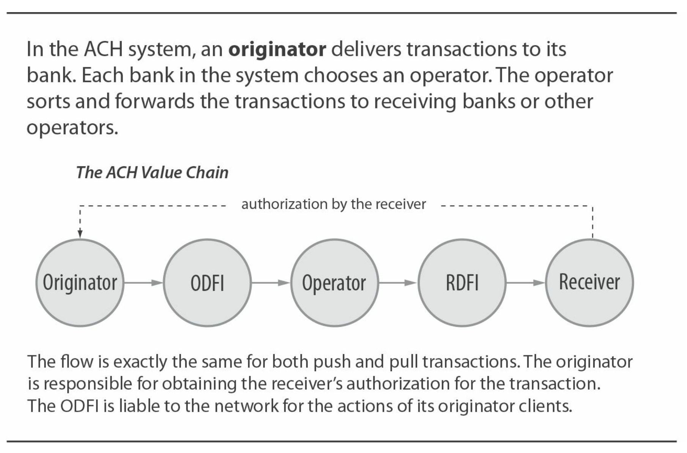
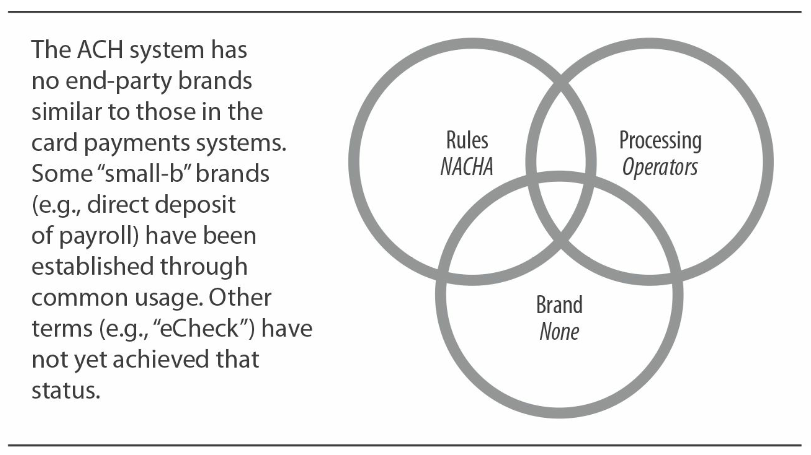
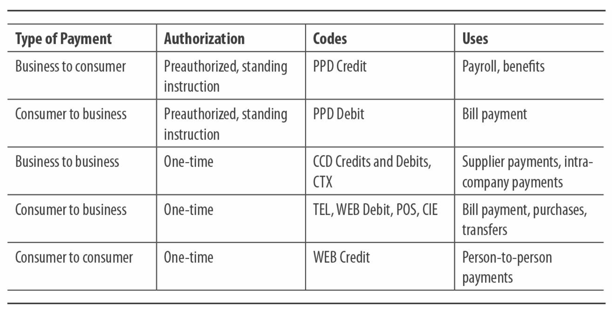
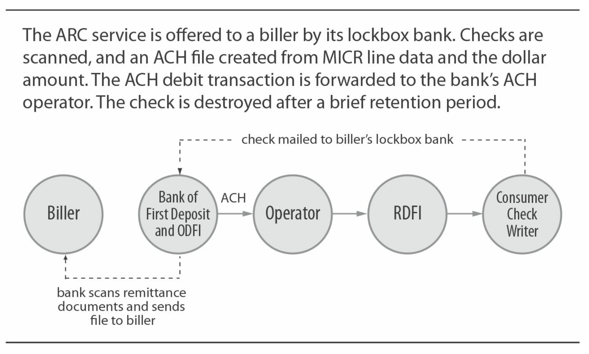
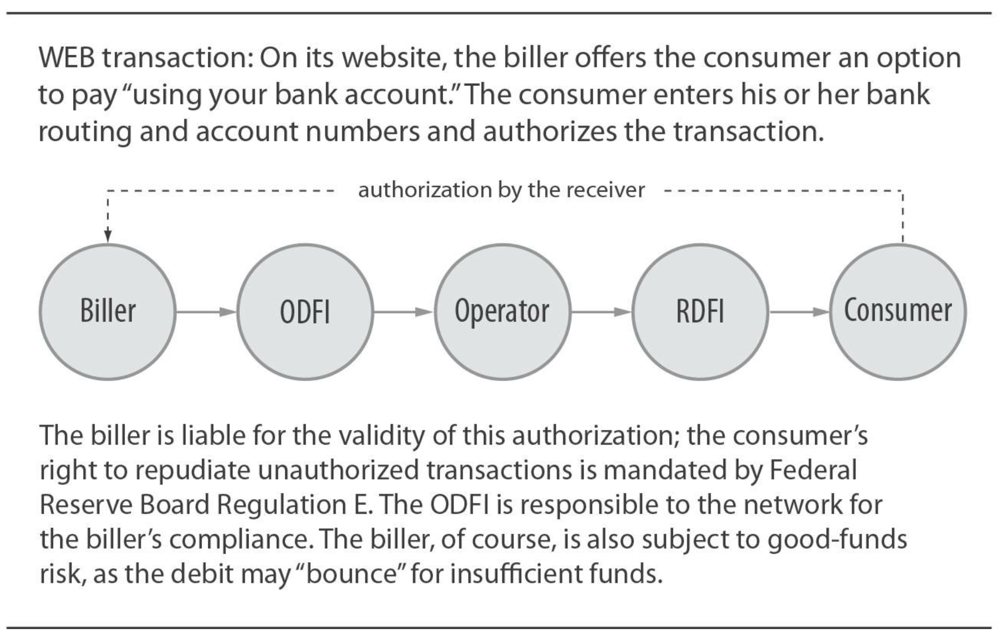

# Core System: ACH

- Type: Pull and push model
- Ownership: Bank-owned
- Regulation: NACHA rules, Federal Reserve Bank regulations
- Payment network economy: Settled by face value except for "same day"
- Processing flow: Electronic; batch processing
- Risk management: Intermediaries and end-user management

## Historical Background

ACH, or Automated Clearing House, is one of the largest payment networks in the United States. It is a bank-owned tool used for various consumer and business applications. The non-profit association NACHA (formerly known as the National Automated Clearing House Association, but now NACHA: The Electronic Payments Association) is the trustee of the ACH network, managing regulations and rule-making processes, and defining NACHA operating rules.

The ACH system was launched in the 1970s by bankers involved in automating check processing. With the introduction of check readers/sorters, it became apparent that all that was needed to post transactions to customer accounts was MICR data. These bankers asked, "Why not exchange MICR data directly instead of exchanging checks and then extracting MICR data?" Note that this was not an early attempt at check truncation or check image clearing but a focus on fully replacing paper transactions with electronic transactions.

_Note: To truly understand the ACH system, please read [Chapter 3](ch3.md) first. ACH was created by many people who did check business at banks._

In the early days of ACH, bankers focused on high-volume, low-risk, repetitive transactions—especially payroll checks, Social Security benefit checks, and insurance premium payments.

As a result, ACH is more connected to every demand deposit account (checking account) in the country than any other payment network in the United States. Businesses wishing to make or receive payments using one of the ACH transaction types can do so and can securely reach every bank consumer and business in the country. Additionally, consumers holding General Purpose Reloadable (GPR) prepaid cards (see Chapter 5) can fund these card accounts via ACH.

### Solving the Chicken and Egg Problem

The nascent ACH network was established in the mid-1970s. It aimed to lower the costs for participating banks. In most areas of the United States, local ACH associations were made up of bankers who participated in each region's check clearinghouse. However, participation was still voluntary, and in the early days, the network faced the "chicken and egg" problem that all new payment networks face. For ACH, the question was, "If most banks don't participate, how do we get consumers to sign up for ACH (e.g., direct deposit of paychecks)? And if we don't have consumers requesting to be paid in this way, how do we get banks to participate?" In this case, the answer was the government. The U.S. government proposed paying Social Security benefits through ACH. It essentially asked banks, "Do you have any customers receiving Social Security benefits?" Of course, the answer was yes. Over a 15-year period, almost all "depository financial institutions," including savings institutions, savings and loans, and credit unions, joined the ACH network.

&nbsp;

## Roles and Value Chain

As background for this section, it is important to understand that ACH is the only payment system in the United States that processes both push and pull transactions:

- The payer initiates a "push" transaction (referred to as ACH credit) and sends money to the receiver.
- The receiver initiates a "pull" transaction (referred to as ACH debit) and pulls money from the payer.

The basic roles and core value chain for "push" payments and "pull" payments are the same, although as we will see, the risks and economics of each type are quite different.

An originator (typically a business) inputs an ACH transaction into the ACH payment system. The originator entrusts the transaction to its bank, known as the ODFI (Originating Depository Financial Institution). The ODFI credits or debits its customer's account (depending on whether the transaction is a "pull" or "push") and then forwards the transaction to its chosen ACH operator. The operator performs the conversion role, passing the transaction to the RDFI (Receiving Depository Financial Institution). (If the ODFI and RDFI use different ACH operators—there are only two operators in the U.S.—the first operator switches the transaction to the second operator.) The RDFI then debits or credits its customer's (receiver's) account, again depending on whether the transaction is a "pull" or "push".

&nbsp;

## ACH Settlement

Today, ACH operators calculate the net settlement total for their banks daily. These totals are submitted to the Federal Reserve, which uses its National Settlement Service to manage the actual settlement process. This results in "zero float" between banks and their customers, although some banks may manage the debiting or crediting of customer accounts' time to accommodate risk policies.

### ACH "Direct Send"

Similar to checks, two banks (or a group of banks) can bilaterally exchange transactions without using an ACH operator. While this does happen, the extremely low cost and efficiency of operators make banks reluctant to do so.

&nbsp;

## Ownership and Regulations

In reality, ACH is owned by its member banks (depository financial institutions). NACHA is a non-profit association overseeing the network. Depository financial institutions (referred to as "banks" here) are members of NACHA directly or through local or regional payment associations. The NACHA bylaws dictate how voting rights are distributed between banks and payment association members.

### Role of NACHA

NACHA's primary role is rule-making, which will be discussed below. Unlike card networks, NACHA does not engage in processing. Transaction switching between intermediary banks is done by ACH operators. (Currently, there are two operators—the Federal Reserve Bank-owned Clearing House and the Electronic Payments Network (EPN).)

### Branding Issues?

It will be interesting to observe how branding issues play out in the e-commerce space. Today, we see third-party brands alongside credit card brands on checkout pages, but if merchants accept ACH "e-checks," they could easily add descriptions like "Pay with your bank account."

NACHA actively engages its member institutions and corporate clients to develop and test product enhancements and new products. However, its operational scale is different from card networks. Its budget is much lower than that of card networks, so it is limited in developing new products distributed through member banks.

NACHA does not play a role in brand creation or promotion. Thus, it is more similar to a check clearinghouse than a card network. Although some "small b" brands have emerged ("direct deposit," controversial "electronic checks"), there is no equivalent acceptance mark for ACH like "Visa" or "NYCE." Despite the lack of brand building, the system still shows strong growth momentum, providing banks and their clients with an effective "track" to use.

### What Sets ACH Apart

With the ACH network being so widespread, why is NACHA's role so limited? The answer is, of course, money. Banks using the ACH network do not have to pay a "tax" to NACHA (compared to card network assessments). As a result, NACHA does not have the resources for product development, brand advertising, or network expansion like card networks. Of course, some may argue that card networks can levy this "tax" because banks generate direct revenue (interest, interchange fees, transaction fees) by issuing card products.

### ACH Regulations

ACH transactions are governed by NACHA's private rules and Federal Reserve Bank regulations.

NACHA rules bind ODFIs, RDFIs, and ACH operators. Initiators, receivers, and third-party service providers are bound by contract agreements with their ODFI and/or RDFI. NACHA rules are voted on by NACHA members: members include larger banks directly affiliated with NACHA and regional associations representing smaller banks through their NACHA membership.

ACH rules specify certain provisions of these downstream contracts, divided into three categories:

- Rules applicable to all ACH transactions
- Rules applicable to ACH debit ("pull") transactions or ACH credit ("push") transactions
- Rules applicable only to certain types of ACH with Standard Entry Class (SEC) codes defined

ACH operators have exclusive rules binding ODFIs and RDFIs using their services. The scope of these rules is very narrow compared to ACH rules. For example, banks using the Federal Reserve Bank as an operator are bound by Operating Circular 4.

In addition to these private rules, U.S. law applies to many types of ACH transactions:

- Federal Reserve Bank Regulation E, implementing the Electronic Fund Transfer Act, applies to consumer transactions. Regulation E is a key regulation that provides consumers with the right to dispute unauthorized transactions.
- U.C.C. 4 and 4a apply to ACH corporate credit transfers.
- Federal government ACH transactions are regulated by the U.S. Department of the Treasury.

In case of conflicting rules, U.S. law obviously takes precedence over private association rules. This means NACHA must ensure that ACH rules correctly reflect or at least do not violate any new U.S. laws or regulations. This has become increasingly complex - partly due to Check-to-ACH conversions and partly due to the growing breadth of federal laws and regulations surrounding consumer rights.

&nbsp;

## Uses of the ACH System

The ACH system is widely used for many types of payments. Large and small businesses, including corporations, governments, and nonprofits, use ACH to pay consumers and collect funds from them. Businesses also use ACH to pay each other and transfer funds internally within the company. In card payment systems, merchant acquirers use ACH to credit funds to merchants from their card payment activities.

Since its inception, ACH volume has steadily increased. In recent years, the growth of WEB transaction types has been particularly strong, which are ad hoc transactions initiated by entering DDA information through online websites. ACH transactions are classified using transaction codes (referred to as SEC or Standard Entry Class codes) to specify transaction types. SEC codes are included in each transaction, providing detailed information about system uses that some other payment systems cannot provide. A complete list of SEC codes can be obtained from NACHA.

The table below lists common ACH transaction types and codes.

&nbsp;

## Risk Management

Companies paying suppliers via ACH bear the burden of collecting and maintaining suppliers' bank account information. On the other hand, payment companies do not disclose their bank account data as they would when sending a check.

### Preauthorized Consumer Transactions

- PPD (Prearranged Payment and Deposit) credit transactions are used for paying salaries, pensions, and consumer benefits.
- PPD debit transactions are primarily used for paying consumers' recurring bills.
- Both transaction types have established early transaction volumes for ACH, and the growth of both categories has remained stable throughout its history. Both require consumers to preauthorize transactions.

### Business-to-Business Transactions

- CCD (Corporate Credit or Debit) credit transactions are used for supplier payments instead of checks. CCD debit transactions can also be used for supplier payments, for example, when a company customer provides the ability to debit their account to a trusted supplier. When using CCD transactions to pay suppliers, customers often have to send remittance data (explaining payment details) separately via mail, fax, or email.
- CCD debit transactions are commonly used for internal fund concentration within companies. For example, companies with bank accounts in multiple states can use ACH to consolidate funds into a single account for investment. CCD debit cards are also used for government tax payments.
- CTX (Corporate Trade Exchange) credit transactions are similar to CCD credit transactions but are designed to carry addenda records with each financial transaction. This way, company customers can pay suppliers and send remittance data with each payment. RDFIs must provide the received data to the receiving company.

### Check Conversion Transactions

Since 2001, NACHA has collaborated with the Federal Reserve Banks (which regulate under the EFTA) to approve a series of new ACH transaction codes to implement check conversion. The scenarios allowed vary by the categories listed below but share some common parameters. As shown in the figure below, each transaction begins with someone writing a paper check. After presenting the check to the payee, the payee collaborates with their bank to create a new ACH transaction to replace the check. The original check is destroyed, and the ACH transaction flows through the ACH network to be debited at the check writer's bank. Payment is no longer governed by check laws and regulations but by ACH rules and regulations.

### Maintaining Bank Account Information

While checks remain the primary form of payment for U.S. vendor payments, business-to-business ACH transactions have been steadily increasing. One challenge is that paying businesses must collect and maintain bank account information (routing and account numbers) for each vendor they pay.

- ARC (Accounts Receivable Conversion) transactions occur when consumer checks are received in a bank's lockbox serving the payee. With the payee's consent, the check is converted into an ACH transaction. Consumers are passively notified; no positive consent from the consumer is required.
- POP (Point-of-Purchase) transactions occur when a consumer presents a check at a retail point of sale. The cashier accepts the check, runs it through the register to capture MICR data, then returns the check to the consumer marked as void. Subsequently, the cashier generates an ACH transaction to debit the consumer's account. (Undoubtedly, POP transactions have caused some confusion among consumers - "Why am I getting my check back?")
- BOC (Back Office Conversion) transactions occur when a consumer presents a check at a point of sale or payee location. As the name suggests, the actual conversion does not happen in front of the consumer but in the back office of the originator (or ODFI). Consumers must be notified, and BOC notices must be posted at the point of sale or other check-receiving locations.

Most business-to-business checks and government-to-consumer checks are not currently eligible for conversion to ACH.

### One-Time Consumer Transactions

This set of transactions is a focal point of interest in the payment industry. While they are often referred to as "eChecks" like the check conversion transactions mentioned above, these transactions do not start with a check but with an "electronic" ACH transaction. The significant difference between these transactions and the PPD debit transactions mentioned above is that, as the name implies, consumers do not pre-authorize temporary transactions assuming ongoing use. Instead, they can be used for one-time consumer transactions. Consumer authorization remains crucial, especially as these transactions (like all ACH consumer debit transactions) are protected by ACH rules and Reg E terms, ensuring consumers can reject unauthorized transactions.

- ACH WEB transactions are authorized by consumers over the internet. Its primary uses include bill payments, e-commerce purchases, and account-to-account transfers. Consumers making online payments are presented with an option such as "Pay from your bank account"; they then input the bank's routing and account numbers. The payee or merchant, acting as the originator, accepts a batch of similar transactions and passes them on to their ODFI. Mechanically, this is the same process used for any ACH debit transaction. However, the potential risks are much higher: consumers could input another person's bank account information, and fraud (or error) may only be discovered when the other person notices incorrect debits on their bank account. Reg E establishes a 60-day window for consumers to reject debits from the statement date, effectively exposing ODFIs and their originating customers to risks for up to 90 days. Despite these potential risks, the actual return rate for WEB transactions remains low, demonstrating the reasonableness of identity verification on both the originator and ODFI sides. Third-party payment services (like PayPal) also use WEB transactions. Typically, third-party payment services split payments into two parts. For example, consider an e-commerce purchase. The payment service directly pays the e-commerce merchant; most commonly, this is an ACH credit transaction where the payment service is the originator. The second transaction occurs when the payment service (again acting as the originator) submits a WEB debit transaction to extract funds from the consumer's account. If the consumer's transaction is fraudulent, such as providing someone else's bank account information, the third party in the example above faces significant risks. To manage this risk, PayPal early on developed a "micro-deposit" scheme aimed at verifying account ownership. By making two random small deposits into the consumer's bank account and then requiring the consumer to report the amounts, PayPal can verify if the consumer controlling the checking account matches the one controlling the PayPal account. Other users of WEB transactions have employed this verification through PayPal. This strategy can protect the originator (and ODFI) from most fraud risks but, of course, does not cover NSF risks.

### WEB Transaction Codes

Since its introduction in 2001, the WEB SEC code has been abbreviated as "WEB." In 2013, NACHA introduced WEB credit transactions for P2P purposes, necessitating the existing transaction types to be referred to as "WEB debit."

- The usage of the "TEL" transaction code mirrors that of WEB debit transactions, except it is obtained via telephone with consumer authorization rather than online.
- The CIE (Customer-Initiated Entry) transaction code is used when a bank initiates a bill payment transaction on a per-transaction basis to facilitate consumer bill payments. However, it should be noted that most online bank bill payment methods are not like this: the consumer's bank debits from the consumer's account (internally accounts to the bank's clearing account) and then initiates a CCD. payment to the payee (aggregating payments from a group of consumers), or sometimes by issuing a check to the payee.
- POS transaction codes are used for one-time authorized purchases made by consumers at a point of sale. In terms of transaction volume, POS transaction types are still small but hold significant promise and interest in the payment community. Here, consumers are not remote but physically present at the point of sale. The merchant, acting as the originator, creates one-time consumer debit transactions. Merchants must obtain consumer authorization and face the same challenges in verifying bank account information as WEB debit originators. Merchants (and third-party payment providers) use various authentication schemes, many of which involve cards (e.g., supermarket membership cards or driver's licenses with payment capabilities) to capture payment instructions. Mobile phones are an apparent potential extension of this concept.
- The WEB credit code introduced in 2013 allows an originator to initiate a one-time credit transfer to another consumer.

### International Transactions

- IAT is the transaction code for all international ACH transactions. Although the transaction itself is not international because both ODFI and RDFI are U.S. chartered financial institutions, the transaction is used when the ODFI knows the transaction is coming from or going to another country. The IAT code is in place to assist ODFIs and RDFIs in managing their compliance requirements under OFAC.

### More Than Just Money

NACHA has been increasingly active in enabling and promoting the use of the ACH network to carry payment-related data and payment remittance information. The CTX transaction type led the way in achieving this goal by using addenda records to carry business remittance data. Since then, NACHA has sponsored the Electronic Bill Information Delivery (EBID) protocol to enable billers to deliver bill data to banks (which is then provided to consumers through online banking), triggering CIE bill payments. Recent NACHA rule changes allow for the transmission of payment-related information and person-to-person payments (new WEB credit transaction type) in free-form text up to 80 characters.

### Who Controls ACH?

While banks control ACH rules (through voting, directly, or through membership in regional ACH associations), there are times when rules seem to have been approved that go against the interests of banks. Most notably, the WEB transaction code was approved in 2001, enabling the large-scale migration of bill payments from checks to electronic products and making the system unpredictable and potentially disadvantageous to banks. Third-party payment service providers, most notably PayPal, use transaction codes to extract inexpensive ACH debit transactions to fund their customers' e-commerce purchases. This means that in some cases, ACH transactions replace debit card transactions that would be more profitable for consumer banks. This has been a source of controversy in the industry. As a result, bankers responsible for ACH rule decisions are becoming increasingly cautious, hoping to avoid more conflicts with the "law of unintended consequences."

&nbsp;

## Risk Management

Users and providers of ACH services face many risks that must be managed:

- ODFIs are responsible for the actions of their originating customers. In particular, authorizations from underlying receivers are typically the responsibility of the originator. This responsibility falls on the ODFI. This is crucial for ACH debit (pull) transactions. If the identity of the underlying receiver is incorrect (e.g., A fraudulently uses B's name) or bank account information is incorrect (B mistakenly provides C's bank account information for C), the ODFI bears financial responsibility. Clearly, the ODFI will seek to shift this responsibility to the originator in their contract; however, if the originator is a small or financially unstable company, they may not be able to reimburse the ODFI.
- RDFIs must accurately post transactions. If the transaction is an ACH debit (pull) transaction, the RDFI must process returns for NSF or disputed transactions according to the specified schedule.
- Merchants and billers originating from ACH debits must manage the risk of returns due to NSF or lack of authorization - the latter disputes may occur within 60 days of the consumer receiving their or your statement or notice from their bank.
- Businesses must carefully manage bank accounts to ensure fraudulent ACH debit transactions (including checks) are not posted. It is important to note that businesses receiving unauthorized ACH debits do not have the Reg E protections that consumers have.

### Economics

The ACH system is designed to be a low-cost, widely used utility for banks and their customers. It largely achieves this goal: the cost for businesses and consumers to use the system is very low, as are the costs for bankers and processors to provide the system. There is no interchange in the ACH system, nor is there direct related float or lending income.

### Bank vs. Non-Bank Competition

Banks and non-banks often compete. When a non-bank offers ACH services to customers, that non-bank (or its customer) must arrange with a bank to act as an ODFI and/or RDFI.

&nbsp;

## ACH Products

### ACH Origins

Banks and third parties vie for business ACH origination, including payroll, pre-authorized debits, business-to-business transactions, and various "electronic checks." Large companies transmit batches of transactions files to their ODFI; both large and small companies can execute fewer ACH transactions through online systems provided by banks or third parties.

The total fees and equivalent fee income paid to banks for ACH origination are significantly less than the income associated with credit card issuance. Pricing for originators varies by business size and transaction type. For example, large batches of payroll files may be priced per transaction at a few cents. Pricing for smaller volumes of B2B transactions may be priced at 50 cents or $1 per transaction.

ACH origination is typically sold as part of a suite of services, such as:

- **Payroll**. Banks and third parties compete to provide payroll services to businesses of various sizes. Services often include tax calculations and withholding, check issuance, ACH origination, and employee reporting and service management.
- **Retail Lockbox**. Banks and third parties compete to manage inbound business remittances via checks, ACH, and wire transfers. Remittance data processing is a key part of this service - it may involve manual data entry (for remittance data accompanying checks) and reformatting data received through ACH transactions. To date, very few business-to-business checks have been converted to ACH.
- **Vendor Payments**. Banks and third parties compete in handling outbound business payments to vendors. These services may include printing checks and related remittance data, preparing ACH transactions, and managing outbound remittance data through various channels, including ACH (CTX), mail, fax, email, transmission to third-party value-added networks, etc. Advanced services may include collecting and managing electronic invoices or maintaining a vendor database.
- **Retail Payment Acceptance**. Banks, card issuers, and other third parties compete to provide services to retailers accepting checks at the point of sale. These services may include converting checks to ACH items or displaying checks as images. Item verification or guarantee may be part of this product. As point-of-sale ACH services mature, logically, the same provider will offer this service to merchants.

Banks and third parties often combine ACH origination with a suite of services and bundle them with value-added services (e.g., state tax calculations sold alongside payroll).

### ACH Receipts

Banks and third parties rarely charge consumers for processing ACH transactions (i.e., acting as RDFIs). Businesses, especially small ones, often charge fees for ACH transactions from their customers.

### ACH Fees

### Bank Processing and Clearing

Banks tend to operate ACH operations centers as cost centers to support multiple areas of the bank (e.g., both consumer account organization and corporate payment organization may use the same ACH "engine"). Large and medium-sized banks purchase specialized software to enable them to process ACH origination and receipts. Smaller banks may outsource some or all of their ACH operations to processors.

Banks remove "on us" ACH transactions submitted by the originator and post these transactions directly to the receiver's account. The bank then sends the remaining original transactions to its ACH operator, who categorizes the transactions and then sends them to the RDFI (if both use the same operator) or to the appropriate other operator. Operators charge fees for receiving and delivering ACH batches (costs depend on volume), but for large volumes, each transaction costs only a few cents.

Historically, the operating costs of bank ACH operations have been relatively low, especially when most transactions are preauthorized consumer debits and credits. For banks, the surge in new transaction types, each with its own risk management and compliance considerations, increases the management costs of the ACH process - partially offsetting the revenue from new services and products.

One challenge is the management of disputed consumer transactions by RDFIs. For inbound PPD debits or WEB transactions, RDFIs do not charge any compensation. If a consumer disputes a transaction, the RDFI bears the cost of managing the dispute - which can often exceed the value of the transaction itself. (This process also occurs with checks - but banks have found electronic ACH processes to be simpler and less costly.)

&nbsp;

## ACH Trends

### Same-Day ACH

In 2015, NACHA implemented a significant new rule for the ACH system. "Same-Day" ACH allows any ODFI to send a batch of ACH transactions on behalf of its originators that settle between two banks on the same day. Importantly, the agreement requires all RDFIs to accept these transactions, meaning all essential attributes of "ubiquity" (the ability to reach any bank account) are met. With the exception of IAT (international) transactions, all standard ACH transactions can be same-day, although individual transaction limits are set at $25,000. The rollout of same-day ACH occurred in stages: starting in September 2016 for ACH credits ("push" payments) and expanding to debits and credits ("pull" payments) in September 2017. Funds must be available in the RDFI's account by the end of the recipient's business day; by March 2018, credits and debits must be provided to the RDFI by 5:00 p.m. local time.

A significant part of same-day ACH transactions is the ACH exchange system for these transactions. ODFIs will pay RDFIs a fixed fee of $0.052 per transaction (referred to by NACHA as the "same-day entry fee"). To get thousands of small RDFIs to agree to the new rule, this was clearly necessary and would require them to invest in new processing capabilities.

Same-day ACH is a significant step forward for the ACH system, but understanding what it is not is equally important - it is not an "instant transfer" system. Same-day ACH relies on the same batch processing protocol used in "normal" ACH transactions.

### Faster Payments

In the UK, banks have implemented a new core payment system called "Faster Payments," which is a real-time immediate funds transfer system. It uses a net settlement model to settle multiple times a day for same-day settlement. It is used for push payments, especially person-to-person, bill payments, and business-to-business transactions. Many other countries are implementing similar systems.

In the US, multiple networks are vying for this role, including networks established by clearinghouses and existing networks controlled by alert services, Visa, Mastercard, Fiserv, and FIS. The Federal Reserve has taken a leadership role in promoting faster payments in the US through the Faster Payments Task Force established in 2015.

### ACH "Cards"

Just as there are private-label credit cards, there are also private-label debit cards. Private-label debit cards are provided to consumers by stores or other businesses. These cards use card network account numbering schemes and follow magnetic stripe and chip configurations to allow the store's POS machines to process them. However, transactions are not sent to card networks but to the store's ODFI, which creates a POS ACH debit transaction to "pull" funds from the cardholder's account. The store (or its service provider) bears the risk of insufficient funds ("chargebacks") and fraud. In exchange, the store pays a small fixed fee (possibly a few cents) rather than the card issuer's discount fee. The attractiveness of ACH cards to stores diminished after the Durbin Amendment (Regulation II), significantly reducing the cost of large bank debit card transactions.

Do not confuse ACH cards with "decoupled debit" cards. In 2007, Capital One issued a controversial card product called "decoupled debit cards": these cards carried the Mastercard network brand and could be used anywhere that accepted those cards, but funds were processed through ACH debit cards. The product was not successful and has been withdrawn from the market.

### International Transactions

While the ACH system is not international, ACH operators and ACH rules support the concept of linking the ACH system with other similar payment systems in other countries/regions. Some early users were companies in other countries paying retirees or employees. The Federal Reserve, as an ACH operator, established links with countries/regions such as Canada and the UK to process credits ("push") payments under the product name "Fed Global."

Enter the translated text:

Enter the translated text:

Companies have also started using these links for cross-border supplier payments. Due to the involvement of multiple payment systems in these types of transactions, there are significant difficulties in terms of timing, risk management, settlement (especially foreign exchange management), and data formats. In the United States and other jurisdictions, there is an increasing focus on compliance with laws aimed at combating money laundering and other criminal activities. The IAT transaction code was implemented in 2009 to help manage these risks.

An international organization composed of banks, ACH systems, and processors is studying the IPFA (International Payments Framework Association) framework to enable cross-border ACH to function without the need for bilateral arrangements between countries.

### ACH Economics - Under the Fee Umbrella

Merchants, billers, and other recipients who receive payments via credit or debit cards typically pay a mix of merchant discount fees - fixed fees and percentage fees largely determined by the card network's interchange fee schedule. For such fund recipients, ACH offers a significant cost-saving opportunity. An e-commerce merchant selling a $100 item may need to pay a $2.50 discount fee if using a credit card, while using ACH "eCheck" may cost only a few cents. In relation to this economic benefit, merchants will have to weigh the cost of returns - whether the transaction will be rejected by the consumer for fraud or will be dishonored due to insufficient funds. For such ACH transactions, at least two economic models are formed: one where the recipient (merchant or biller) bears these risks, and another where a third party bears some or all of the recipient's risks. If a third party bears the risk, then the transaction costs for the merchant will certainly increase.

&nbsp;

## Key Suppliers

Due to the coverage of the ACH system, there is a large ecosystem of providers involved in initiating, receiving, or processing ACH in some way. Many banks and processors integrate ACH functionality with other payment products.

- NACHA sets, develops, and enforces ACH rules and handles the definition of many new products and transaction types. NACHA balances the needs of small financial institutions (some of which are only RDFIs) with the demands of larger ODFIs.
- The Federal Reserve plays a crucial role in the ACH, serving as a regulator, one of the two major ACH operators, and a provider of settlement services.
- Clearinghouses have another major ACH operator, EPN.
- Regional Payments Associations (formerly known as Regional Automated Clearing Houses) typically operate within a regional scope; they serve as the link between their depository financial institutions and NACHA, as well as a source of industry education.
- ACH processing software vendors and service providers. All major bank "core processors" offer ACH receipt and origination services to their clients.
- Major originating banks, which have made significant investments in ACH capabilities to support corporate transaction initiation. NACHA publishes the transaction volume of ODFIs annually.
- Major originators make their voices heard through their ODFIs and directly to NACHA through a series of councils operated by NACHA. Although the councils do not have rule-making authority, both banks and non-banks can participate, and the councils are represented on the NACHA Board. The Association for Financial Professionals (AFP), representing corporate finance requirements, also provides forums for businesses on ACH issues.
- The U.S. government is an active user and supporter of the ACH system, complying with NACHA operating rules.

&nbsp;

## Summary: ACH

### Key Trends in ACH

The simplicity, wide applicability, and cost-effectiveness of the ACH system make it one of the most important electronic transfer systems in the United States. A unique feature of the ACH system is its ability to carry a large amount of data and process payment transactions, enabling interesting new applications, especially in bill payments and B2B transactions. However, the ACH system will face continued competition from card payment systems with stronger branding that offer different economic models to their providers.

- The pressure to accelerate settlement speeds is increasing, and there is a growing demand for parallel (but distinct) developments in real-time payments. These demands can be met through ACH or other systems competing with ACH.
- Growth and complexity: Overall, ACH volume continues to grow, with a surge in transaction types. Banks are increasing investments to manage complexity.
- New ACH transaction types enable new trade and payment methods, but also increase risks.
- ACH has been a driving force behind "alternative payments" providers in the online space. Now, ACH is poised to play the same role in point-of-sale and mobile payments.
- International ACH volumes are increasing, and new compliance requirements are focusing attention on these transactions.

### Sources of Information—ACH

- PaymentsNews.com
- NACHA
- Regional ACH Payment Associations
- Federal Reserve Retail Payments Office
